# Component Hierarchy

## Overview

Cola Records is built with React 19 and contains 87 components organized into screens, layout, UI primitives, and feature-specific components. The UI layer uses Tailwind CSS for styling and Radix UI for accessible primitives.

**Total Components:** 87
**Framework:** React 19 + TypeScript
**Styling:** Tailwind CSS
**UI Primitives:** Radix UI

## Main Component Tree

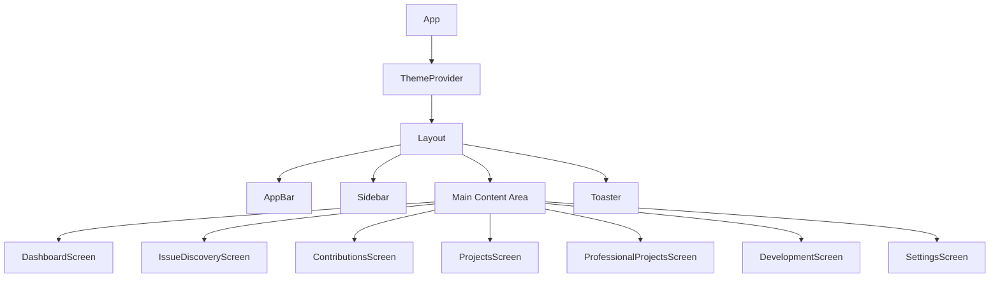

## Screen Components (7)

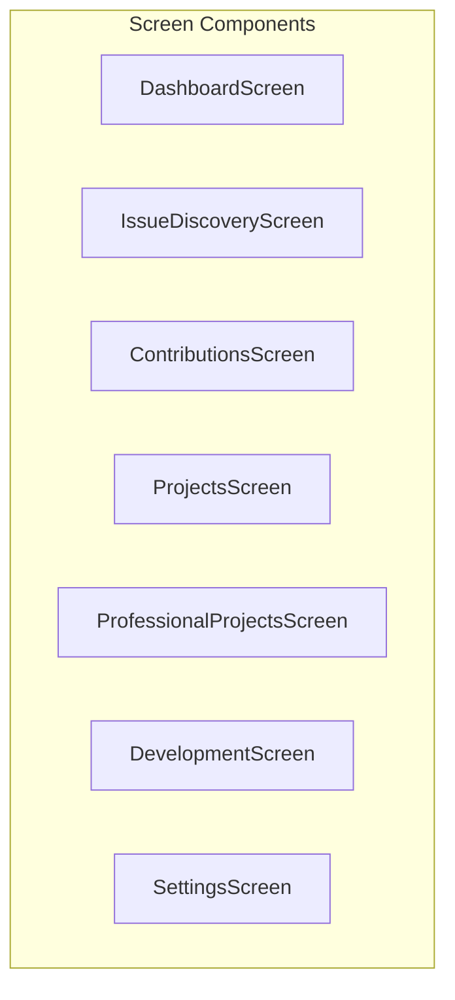

| Screen                     | Path             | Purpose                         |
| -------------------------- | ---------------- | ------------------------------- |
| DashboardScreen            | `/`              | Overview and quick actions      |
| IssueDiscoveryScreen       | `/issues`        | Search and filter GitHub issues |
| ContributionsScreen        | `/contributions` | Track active contributions      |
| ProjectsScreen             | `/projects`      | Manage open source projects     |
| ProfessionalProjectsScreen | `/professional`  | Professional project tracking   |
| DevelopmentScreen          | `/development`   | Development tools and terminals |
| SettingsScreen             | `/settings`      | Application configuration       |

## Layout Components (3)

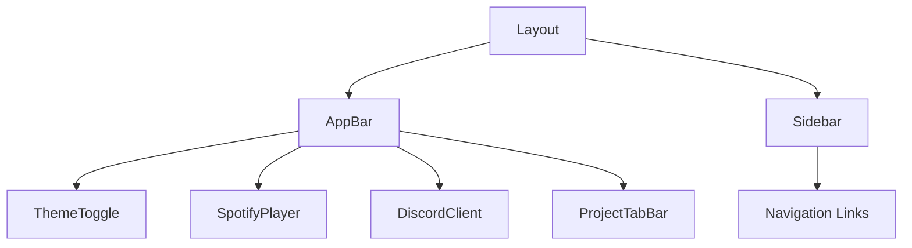

| Component | Purpose                             |
| --------- | ----------------------------------- |
| Layout    | Main application shell with routing |
| AppBar    | Top navigation bar with controls    |
| Sidebar   | Left navigation with screen links   |

### Layout Component Details

#### Layout (`components/layout/Layout.tsx`)

Main application wrapper that provides the overall structure with sidebar navigation and content area.

**Props:**
| Prop | Type | Description |
|------|------|-------------|
| `currentScreen` | `Screen` | Currently active screen identifier |
| `onScreenChange` | `(screen: Screen) => void` | Callback when screen changes |
| `children` | `React.ReactNode` | Screen content to render |
| `projects` | `OpenProject[]` | Open projects for tab bar |
| `activeProjectId` | `string \| null` | Currently active project ID |
| `onSelectProject` | `(id: string) => void` | Callback when project tab selected |
| `onCloseProject` | `(id: string) => void` | Callback when project tab closed |

**Behavior:**

- Sidebar auto-collapses when screen changes
- Passes open projects to AppBar for tab bar display
- Manages collapsed/expanded sidebar state

#### AppBar (`components/layout/AppBar.tsx`)

Top navigation bar containing the screen title, integrations, and project tabs.

**Props:**
| Prop | Type | Description |
|------|------|-------------|
| `title` | `string` | Current screen title |
| `projects` | `OpenProject[]` | Open projects for tab bar |
| `activeProjectId` | `string \| null` | Currently active project ID |
| `onSelectProject` | `(id: string) => void` | Callback when project tab selected |
| `onCloseProject` | `(id: string) => void` | Callback when project tab closed |

**Features:**

- Screen title display (left)
- Spotify player integration
- Discord client integration
- Chrome launcher button
- Project tab bar (center, visible from any screen)
- Theme toggle (right)

## UI Base Components (22)

Built on Radix UI primitives for accessibility:

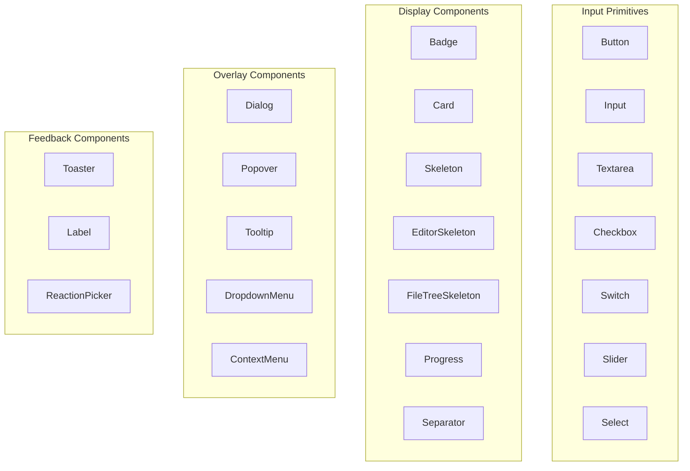

## Feature Components

### Contributions (4)

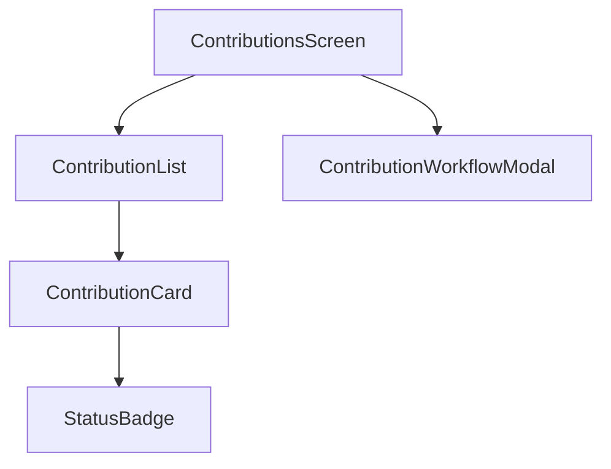

| Component                 | Purpose                                     |
| ------------------------- | ------------------------------------------- |
| ContributionList          | List of all contributions                   |
| ContributionCard          | Individual contribution display             |
| ContributionWorkflowModal | Contribution creation workflow              |
| StatusBadge               | Status indicator (in_progress, ready, etc.) |

### Issues (9)

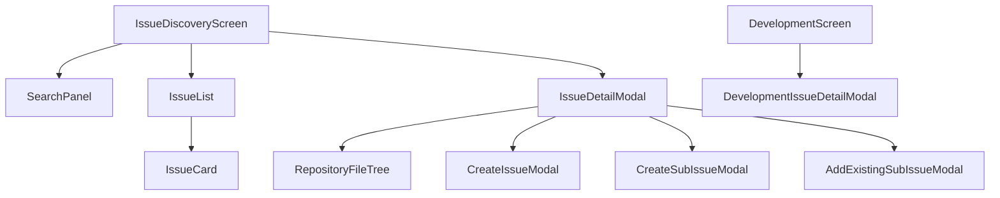

| Component                   | Purpose                          |
| --------------------------- | -------------------------------- |
| IssueList                   | Paginated issue list             |
| IssueCard                   | Issue preview card               |
| IssueDetailModal            | Full issue details               |
| SearchPanel                 | Issue search interface           |
| RepositoryFileTree          | Browse repository files          |
| CreateIssueModal            | Create new GitHub issue          |
| CreateSubIssueModal         | Create sub-issue                 |
| AddExistingSubIssueModal    | Link existing issue as sub-issue |
| DevelopmentIssueDetailModal | Issue details in dev context     |

### Pull Requests (4)

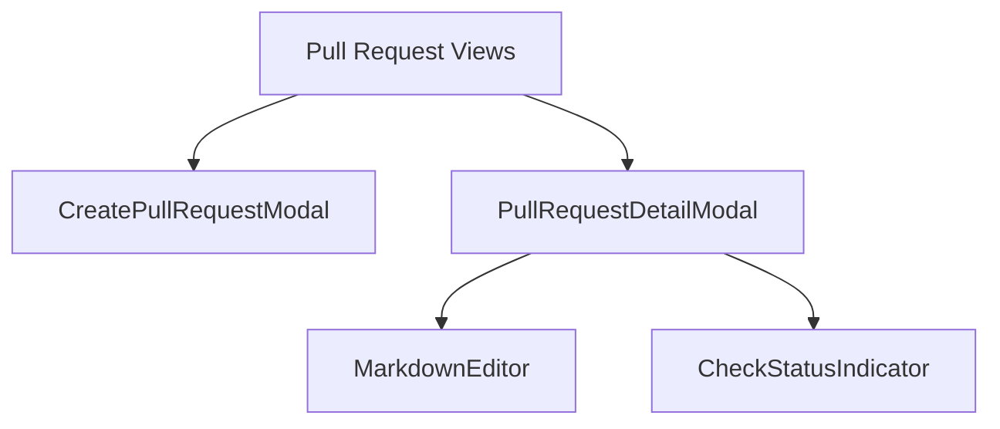

| Component              | Purpose                       |
| ---------------------- | ----------------------------- |
| CreatePullRequestModal | Create new pull request       |
| PullRequestDetailModal | PR details and comments       |
| MarkdownEditor         | Markdown editing with preview |
| CheckStatusIndicator   | CI/CD status display          |

### Branches (1)

| Component         | Purpose                        |
| ----------------- | ------------------------------ |
| BranchDetailModal | Branch information and actions |

### Projects (2)

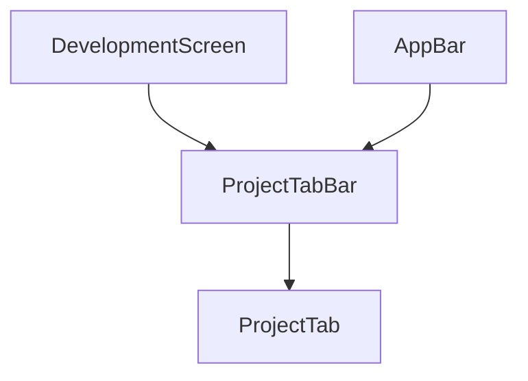

| Component     | Purpose                   |
| ------------- | ------------------------- |
| ProjectTabBar | Tab bar for open projects |
| ProjectTab    | Individual project tab    |

#### ProjectTabBar (`components/projects/ProjectTabBar.tsx`)

Tab bar component for managing multiple open projects. Displayed in the AppBar, allowing project switching from any screen.

**Props:**
| Prop | Type | Description |
|------|------|-------------|
| `projects` | `OpenProject[]` | Array of open projects |
| `activeProjectId` | `string \| null` | Currently active project ID |
| `onSelectProject` | `(id: string) => void` | Callback when tab clicked |
| `onCloseProject` | `(id: string) => void` | Callback when tab closed |
| `onAddProject` | `() => void` | Optional callback for add button |
| `maxProjects` | `number` | Maximum allowed projects (default: 5) |

**Features:**

- Renders ProjectTab for each open project
- Shows "+" button when under max limit
- Displays "Max X projects" indicator when at limit
- Returns null when no projects are open

#### ProjectTab (`components/projects/ProjectTab.tsx`)

Individual tab representing a single open project with status indicator and close button.

**Props:**
| Prop | Type | Description |
|------|------|-------------|
| `project` | `OpenProject` | Project data including contribution |
| `isActive` | `boolean` | Whether this tab is currently selected |
| `onClick` | `() => void` | Callback when tab clicked |
| `onClose` | `() => void` | Callback when close button clicked |

**Visual States:**
| State | Indicator Color | Description |
|-------|-----------------|-------------|
| `running` | Green | Code-server running for project |
| `starting` | Yellow (pulsing) | Container starting up |
| `error` | Red | Error occurred |
| `idle` | Gray | Not yet started |

**Features:**

- Extracts project name from repository URL
- Shows local path as tooltip
- Close button visible on hover (always visible when active)
- Keyboard accessible (Enter/Space to select)

### Tools (7)

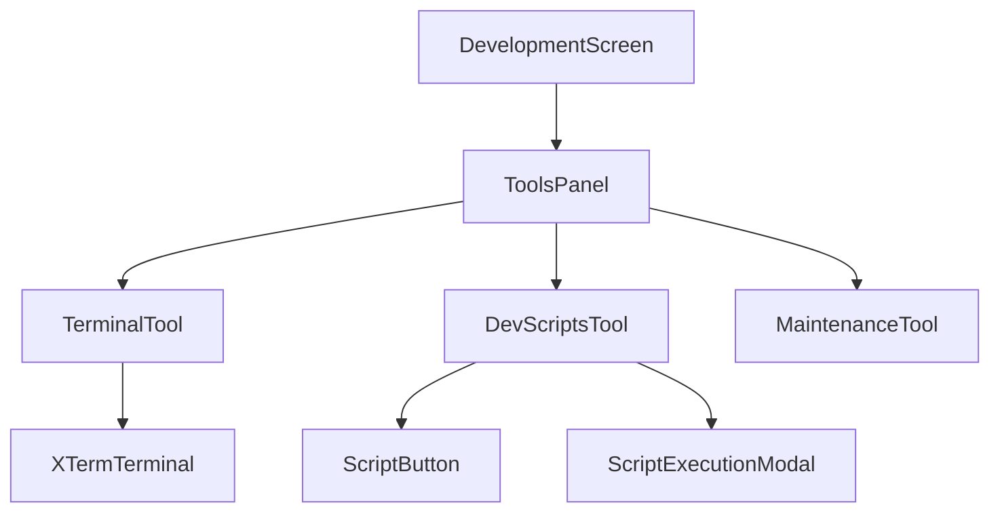

| Component            | Purpose                         |
| -------------------- | ------------------------------- |
| ToolsPanel           | Container for development tools |
| TerminalTool         | Integrated terminal interface   |
| DevScriptsTool       | Custom script management        |
| MaintenanceTool      | Project maintenance actions     |
| XTermTerminal        | xterm.js terminal emulator      |
| ScriptButton         | Executable script button        |
| ScriptExecutionModal | Script execution with output    |

### Settings (4)

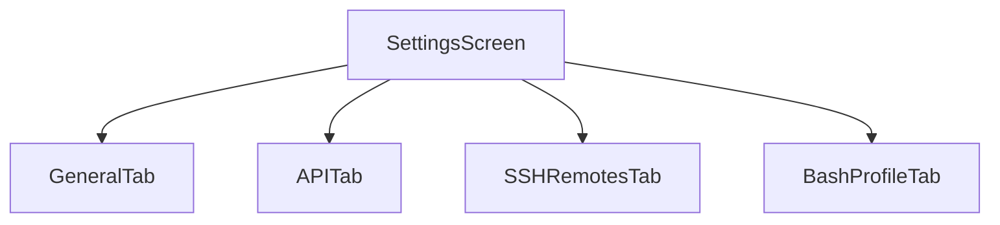

| Component      | Purpose                      |
| -------------- | ---------------------------- |
| GeneralTab     | General application settings |
| APITab         | API tokens and integrations  |
| SSHRemotesTab  | SSH remote configurations    |
| BashProfileTab | Shell profile management     |

### Spotify (7)

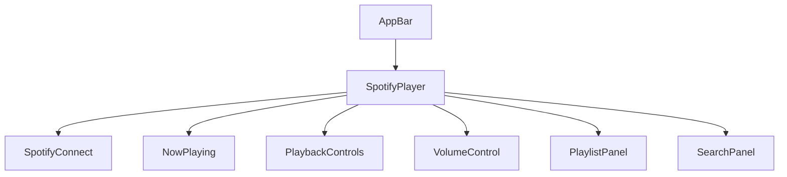

| Component        | Purpose                       |
| ---------------- | ----------------------------- |
| SpotifyPlayer    | Main Spotify player container |
| SpotifyConnect   | OAuth connection flow         |
| NowPlaying       | Current track display         |
| PlaybackControls | Play/pause/skip controls      |
| VolumeControl    | Volume slider                 |
| PlaylistPanel    | Playlist browser              |
| SearchPanel      | Spotify search                |

### Discord (19)

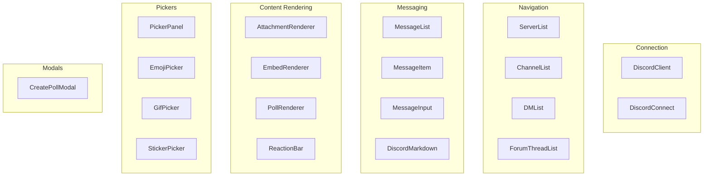

| Component          | Purpose                   |
| ------------------ | ------------------------- |
| DiscordClient      | Main Discord interface    |
| DiscordConnect     | Token-based connection    |
| ServerList         | Guild/server list         |
| ChannelList        | Channel navigation        |
| DMList             | Direct message list       |
| ForumThreadList    | Forum thread browser      |
| MessageList        | Message history           |
| MessageItem        | Individual message        |
| MessageInput       | Message composition       |
| DiscordMarkdown    | Discord markdown renderer |
| AttachmentRenderer | File attachment display   |
| EmbedRenderer      | Rich embed display        |
| PollRenderer       | Poll display              |
| ReactionBar        | Message reactions         |
| PickerPanel        | Emoji/GIF/sticker panel   |
| EmojiPicker        | Emoji selector            |
| GifPicker          | GIF search and select     |
| StickerPicker      | Sticker selector          |
| CreatePollModal    | Poll creation             |

### Shared (2)

| Component     | Purpose                 |
| ------------- | ----------------------- |
| ErrorBoundary | React error boundary    |
| ThemeToggle   | Light/dark theme switch |

> **Note:** ThemeProvider is located in `src/renderer/providers/`, not `components/`.

## Component Statistics

| Category      | Count  |
| ------------- | ------ |
| Screens       | 7      |
| Layout        | 3      |
| UI Base       | 22     |
| Contributions | 4      |
| Issues        | 9      |
| Pull Requests | 4      |
| Branches      | 1      |
| Projects      | 2      |
| Tools         | 7      |
| Settings      | 4      |
| Spotify       | 7      |
| Discord       | 19     |
| Shared        | 2      |
| **Total**     | **87** |

---

**Generated by:** APO (Documentation Specialist)
**Source:** JUNO Audit Report 2026-02-11
