# Component Hierarchy

## Overview

Cola Records is built with React 19 and contains 164 components organized into screens, layout, UI primitives, and feature-specific components. The UI layer uses Tailwind CSS for styling and Radix UI for accessible primitives.

**Total Components:** 164
**Framework:** React 19 + TypeScript
**Styling:** Tailwind CSS
**UI Primitives:** Radix UI

## Main Component Tree

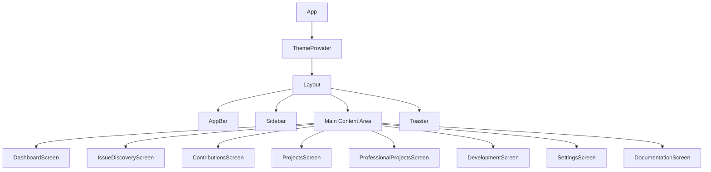

## Screen Components (8)

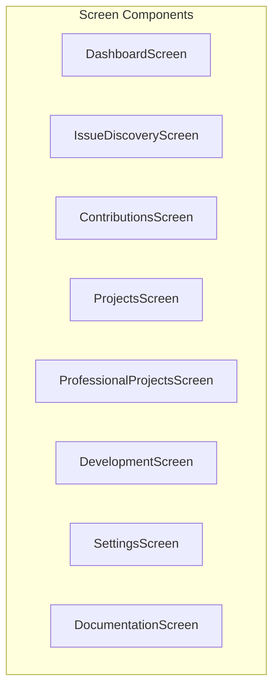

| Screen                     | Path             | Purpose                         |
| -------------------------- | ---------------- | ------------------------------- |
| DashboardScreen            | `/`              | Overview and quick actions      |
| IssueDiscoveryScreen       | `/issues`        | Search and filter GitHub issues |
| ContributionsScreen        | `/contributions` | Track active contributions      |
| ProjectsScreen             | `/projects`      | Manage open source projects     |
| ProfessionalProjectsScreen | `/professional`  | Professional project tracking   |
| DevelopmentScreen          | `/development`   | Development tools and terminals |
| SettingsScreen             | `/settings`      | Application configuration       |
| DocumentationScreen        | `/documentation` | In-app documentation viewer     |

## Layout Components (3)

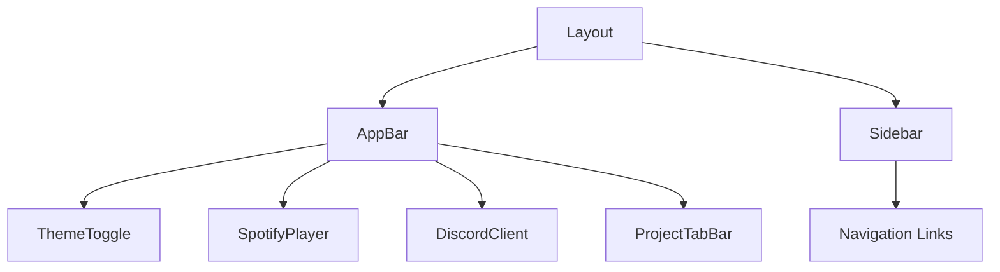

| Component | Purpose                             |
| --------- | ----------------------------------- |
| Layout    | Main application shell with routing |
| AppBar    | Top navigation bar with controls    |
| Sidebar   | Left navigation with screen links   |

### Layout Component Details

#### Layout (`components/layout/Layout.tsx`)

Main application wrapper that provides the overall structure with sidebar navigation and content area.

**Props:**
| Prop | Type | Description |
|------|------|-------------|
| `currentScreen` | `Screen` | Currently active screen identifier |
| `onScreenChange` | `(screen: Screen) => void` | Callback when screen changes |
| `children` | `React.ReactNode` | Screen content to render |
| `projects` | `OpenProject[]` | Open projects for tab bar |
| `activeProjectId` | `string \| null` | Currently active project ID |
| `onSelectProject` | `(id: string) => void` | Callback when project tab selected |
| `onCloseProject` | `(id: string) => void` | Callback when project tab closed |

**Behavior:**

- Sidebar auto-collapses when screen changes
- Passes open projects to AppBar for tab bar display
- Manages collapsed/expanded sidebar state

#### AppBar (`components/layout/AppBar.tsx`)

Top navigation bar containing the screen title, integrations, and project tabs.

**Props:**
| Prop | Type | Description |
|------|------|-------------|
| `title` | `string` | Current screen title |
| `projects` | `OpenProject[]` | Open projects for tab bar |
| `activeProjectId` | `string \| null` | Currently active project ID |
| `onSelectProject` | `(id: string) => void` | Callback when project tab selected |
| `onCloseProject` | `(id: string) => void` | Callback when project tab closed |

**Features:**

- Screen title display (left)
- Spotify player integration
- Discord client integration
- Chrome launcher button
- Project tab bar (center, visible from any screen)
- Theme toggle (right)

## UI Base Components (22)

Built on Radix UI primitives for accessibility:

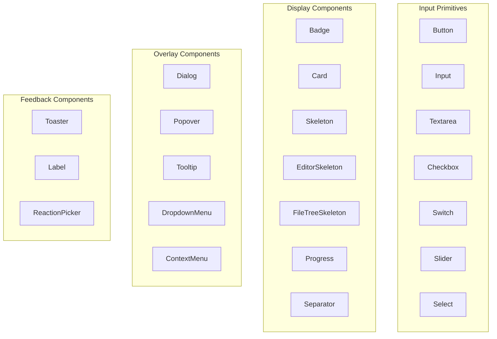

## Feature Components

### Contributions (4)

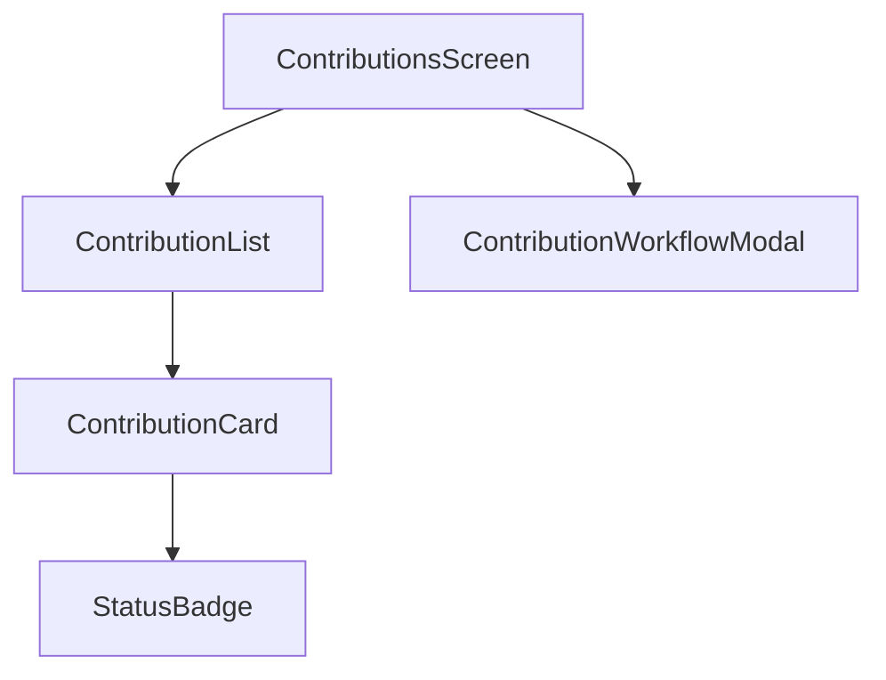

| Component                 | Purpose                                     |
| ------------------------- | ------------------------------------------- |
| ContributionList          | List of all contributions                   |
| ContributionCard          | Individual contribution display             |
| ContributionWorkflowModal | Contribution creation workflow              |
| StatusBadge               | Status indicator (in_progress, ready, etc.) |

### Issues (9)

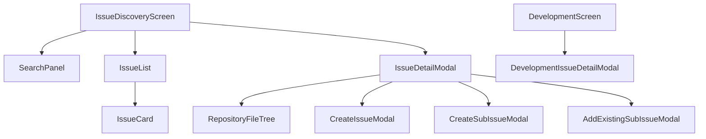

| Component                   | Purpose                          |
| --------------------------- | -------------------------------- |
| IssueList                   | Paginated issue list             |
| IssueCard                   | Issue preview card               |
| IssueDetailModal            | Full issue details               |
| SearchPanel                 | Issue search interface           |
| RepositoryFileTree          | Browse repository files          |
| CreateIssueModal            | Create new GitHub issue          |
| CreateSubIssueModal         | Create sub-issue                 |
| AddExistingSubIssueModal    | Link existing issue as sub-issue |
| DevelopmentIssueDetailModal | Issue details in dev context     |

### Pull Requests (5)

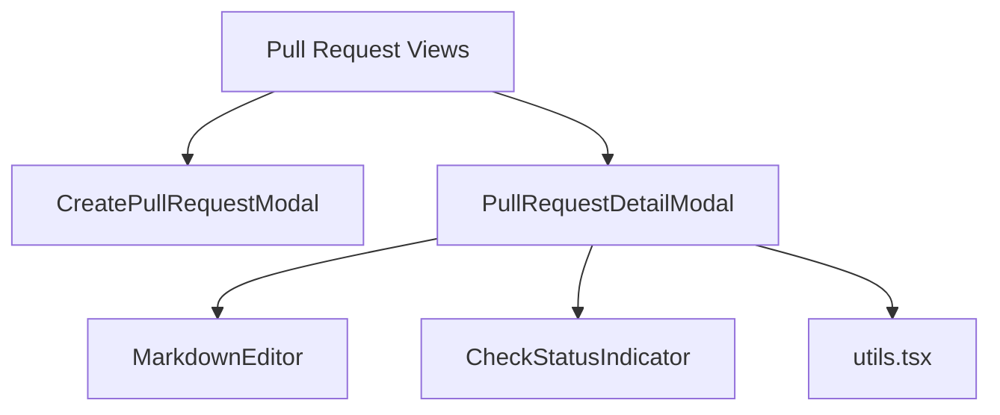

| Component              | Purpose                                 |
| ---------------------- | --------------------------------------- |
| CreatePullRequestModal | Create new pull request                 |
| PullRequestDetailModal | PR details and comments                 |
| MarkdownEditor         | Markdown editing with preview           |
| CheckStatusIndicator   | CI/CD status display                    |
| utils.tsx              | PR detail utility functions and helpers |

### Branches (1)

| Component         | Purpose                        |
| ----------------- | ------------------------------ |
| BranchDetailModal | Branch information and actions |

### Projects (8)

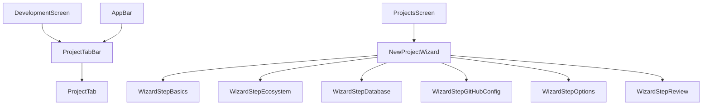

| Component              | Purpose                                  |
| ---------------------- | ---------------------------------------- |
| ProjectTabBar          | Tab bar for open projects                |
| ProjectTab             | Individual project tab                   |
| NewProjectWizard       | Multi-step project creation wizard       |
| WizardStepBasics       | Project name, path, and description step |
| WizardStepDatabase     | Database engine and ORM selection step   |
| WizardStepEcosystem    | Ecosystem and framework selection step   |
| WizardStepGitHubConfig | GitHub repository configuration step     |
| WizardStepOptions      | Additional project options step          |
| WizardStepReview       | Final review and confirmation step       |

#### ProjectTabBar (`components/projects/ProjectTabBar.tsx`)

Tab bar component for managing multiple open projects. Displayed in the AppBar, allowing project switching from any screen.

**Props:**
| Prop | Type | Description |
|------|------|-------------|
| `projects` | `OpenProject[]` | Array of open projects |
| `activeProjectId` | `string \| null` | Currently active project ID |
| `onSelectProject` | `(id: string) => void` | Callback when tab clicked |
| `onCloseProject` | `(id: string) => void` | Callback when tab closed |
| `onAddProject` | `() => void` | Optional callback for add button |
| `maxProjects` | `number` | Maximum allowed projects (default: 5) |

**Features:**

- Renders ProjectTab for each open project
- Shows "+" button when under max limit
- Displays "Max X projects" indicator when at limit
- Returns null when no projects are open

#### ProjectTab (`components/projects/ProjectTab.tsx`)

Individual tab representing a single open project with status indicator and close button.

**Props:**
| Prop | Type | Description |
|------|------|-------------|
| `project` | `OpenProject` | Project data including contribution |
| `isActive` | `boolean` | Whether this tab is currently selected |
| `onClick` | `() => void` | Callback when tab clicked |
| `onClose` | `() => void` | Callback when close button clicked |

**Visual States:**
| State | Indicator Color | Description |
|-------|-----------------|-------------|
| `running` | Green | Code-server running for project |
| `starting` | Yellow (pulsing) | Container starting up |
| `error` | Red | Error occurred |
| `idle` | Gray | Not yet started |

**Features:**

- Extracts project name from repository URL
- Shows local path as tooltip
- Close button visible on hover (always visible when active)
- Keyboard accessible (Enter/Space to select)

### Tools (50)

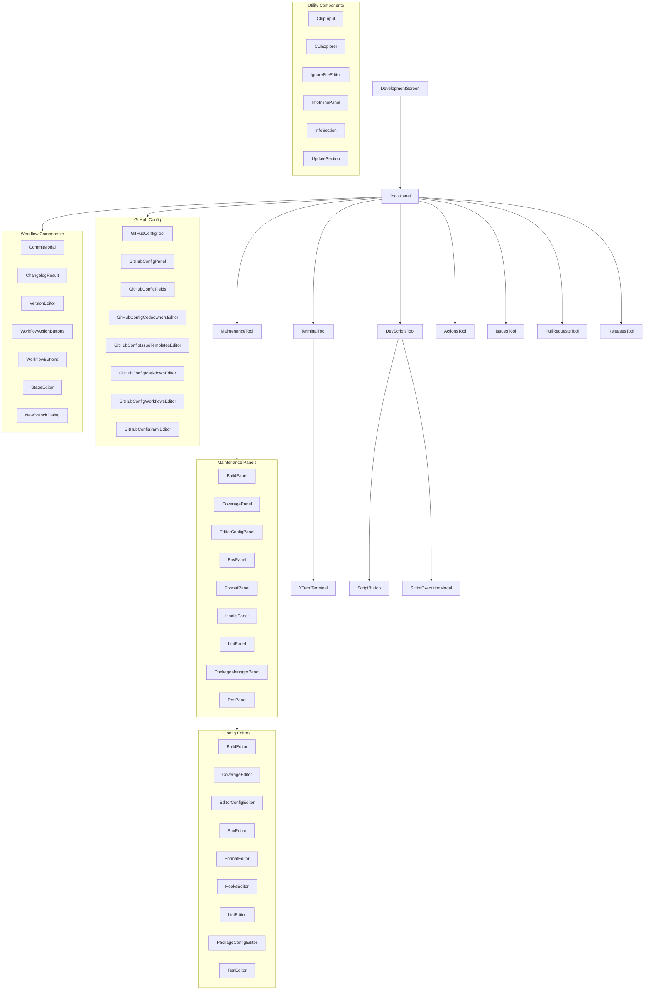

#### Core Tools

| Component            | Purpose                              |
| -------------------- | ------------------------------------ |
| ToolsPanel           | Container for development tools      |
| TerminalTool         | Integrated terminal interface        |
| DevScriptsTool       | Custom script management             |
| MaintenanceTool      | Project maintenance actions          |
| XTermTerminal        | xterm.js terminal emulator           |
| ScriptButton         | Executable script button             |
| ScriptExecutionModal | Script execution with output         |
| ActionsTool          | GitHub Actions workflow viewer       |
| IssuesTool           | Repository issues panel              |
| PullRequestsTool     | Repository pull requests panel       |
| ReleasesTool         | Repository releases management panel |

#### Maintenance Panels

| Component           | Purpose                             |
| ------------------- | ----------------------------------- |
| BuildPanel          | Build tool detection and management |
| CoveragePanel       | Code coverage configuration panel   |
| EditorConfigPanel   | EditorConfig file management panel  |
| EnvPanel            | Environment file management panel   |
| FormatPanel         | Code formatter configuration panel  |
| HooksPanel          | Git hooks management panel          |
| LintPanel           | Linter configuration panel          |
| PackageManagerPanel | Package manager operations panel    |
| TestPanel           | Test framework configuration panel  |

#### Config Editors

| Component           | Purpose                                      |
| ------------------- | -------------------------------------------- |
| BuildEditor         | Build tool config file editor                |
| CoverageEditor      | Coverage config editor                       |
| EditorConfigEditor  | .editorconfig file editor                    |
| EnvEditor           | Environment variable file editor             |
| FormatEditor        | Formatter config file editor                 |
| HooksEditor         | Git hooks config editor                      |
| LintEditor          | Linter config file editor                    |
| PackageConfigEditor | Package manifest (package.json, etc.) editor |
| TestEditor          | Test framework config editor                 |

#### GitHub Config Components

| Component                        | Purpose                             |
| -------------------------------- | ----------------------------------- |
| GitHubConfigTool                 | GitHub .github/ directory manager   |
| GitHubConfigPanel                | Main GitHub config panel            |
| GitHubConfigFields               | GitHub config form fields           |
| GitHubConfigCodeownersEditor     | CODEOWNERS file editor              |
| GitHubConfigIssueTemplatesEditor | Issue template manager              |
| GitHubConfigMarkdownEditor       | GitHub markdown file editor         |
| GitHubConfigWorkflowsEditor      | GitHub Actions workflow editor      |
| GitHubConfigYamlEditor           | YAML editor for GitHub config files |

#### Workflow Components

| Component             | Purpose                            |
| --------------------- | ---------------------------------- |
| CommitModal           | Git commit dialog with AI messages |
| ChangelogResult       | AI-generated changelog display     |
| VersionEditor         | Semantic version management editor |
| WorkflowActionButtons | Workflow action button group       |
| WorkflowButtons       | Workflow control buttons           |
| StageEditor           | Git staging area editor            |
| NewBranchDialog       | New branch creation dialog         |

#### Utility Components

| Component        | Purpose                               |
| ---------------- | ------------------------------------- |
| ChipInput        | Tag/chip input component              |
| CLIExplorer      | CLI tool discovery and explorer       |
| IgnoreFileEditor | Ignore file (.gitignore, etc.) editor |
| InfoInlinePanel  | Inline project info display panel     |
| InfoSection      | Project info section                  |
| UpdateSection    | Update information section            |

### Settings (8)

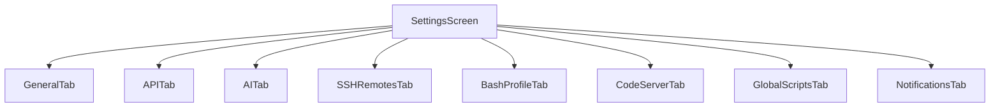

| Component        | Purpose                               |
| ---------------- | ------------------------------------- |
| GeneralTab       | General application settings          |
| APITab           | API tokens and integrations           |
| AITab            | AI/LLM provider configuration         |
| SSHRemotesTab    | SSH remote configurations             |
| BashProfileTab   | Shell profile management              |
| CodeServerTab    | Code-server Docker container settings |
| GlobalScriptsTab | Global dev scripts management         |
| NotificationsTab | Notification preferences              |

### Spotify (7)

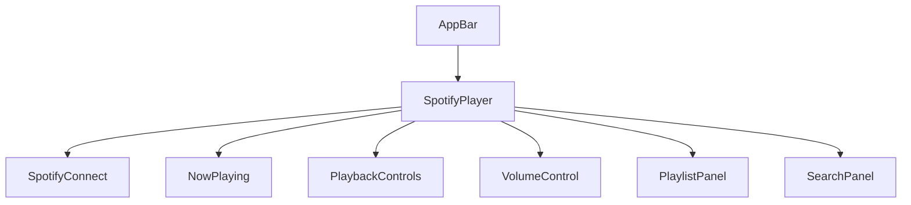

| Component        | Purpose                       |
| ---------------- | ----------------------------- |
| SpotifyPlayer    | Main Spotify player container |
| SpotifyConnect   | OAuth connection flow         |
| NowPlaying       | Current track display         |
| PlaybackControls | Play/pause/skip controls      |
| VolumeControl    | Volume slider                 |
| PlaylistPanel    | Playlist browser              |
| SearchPanel      | Spotify search                |

### Discord (19)

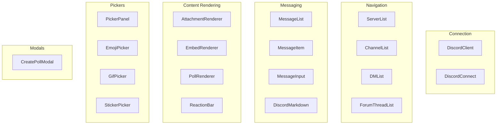

| Component          | Purpose                   |
| ------------------ | ------------------------- |
| DiscordClient      | Main Discord interface    |
| DiscordConnect     | Token-based connection    |
| ServerList         | Guild/server list         |
| ChannelList        | Channel navigation        |
| DMList             | Direct message list       |
| ForumThreadList    | Forum thread browser      |
| MessageList        | Message history           |
| MessageItem        | Individual message        |
| MessageInput       | Message composition       |
| DiscordMarkdown    | Discord markdown renderer |
| AttachmentRenderer | File attachment display   |
| EmbedRenderer      | Rich embed display        |
| PollRenderer       | Poll display              |
| ReactionBar        | Message reactions         |
| PickerPanel        | Emoji/GIF/sticker panel   |
| EmojiPicker        | Emoji selector            |
| GifPicker          | GIF search and select     |
| StickerPicker      | Sticker selector          |
| CreatePollModal    | Poll creation             |

### Dashboard (7)

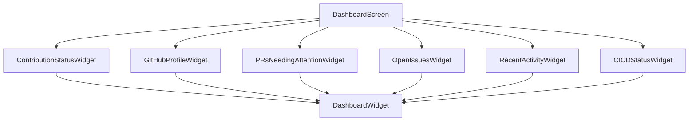

| Component                 | Purpose                                                      |
| ------------------------- | ------------------------------------------------------------ |
| DashboardWidget           | Reusable card wrapper with loading, error, and empty states  |
| GitHubProfileWidget       | Authenticated user profile with repos, stars, language stats |
| ContributionStatusWidget  | Open PRs, merged PRs, open/closed issues metrics             |
| RecentActivityWidget      | Latest GitHub events (push, PR, issue, release, etc.)        |
| OpenIssuesWidget          | Issues assigned to or authored by the user                   |
| PRsNeedingAttentionWidget | PRs with review and CI status indicators                     |
| CICDStatusWidget          | Latest CI/CD pipeline run per repository                     |

### Documentation (3)

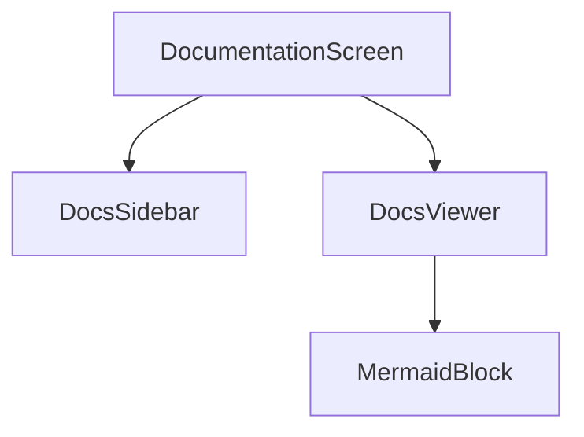

| Component    | Purpose                                                  |
| ------------ | -------------------------------------------------------- |
| DocsSidebar  | Collapsible category navigation for documentation files  |
| DocsViewer   | Markdown renderer with ReactMarkdown and mermaid support |
| MermaidBlock | Renders mermaid diagram code blocks as SVG via DOMPurify |

### Updates (1)

| Component          | Purpose                                                                |
| ------------------ | ---------------------------------------------------------------------- |
| UpdateNotification | Dialog for app update lifecycle (available, downloading, ready, error) |

### Shared (2)

| Component     | Purpose                 |
| ------------- | ----------------------- |
| ErrorBoundary | React error boundary    |
| ThemeToggle   | Light/dark theme switch |

> **Note:** ThemeProvider is located in `src/renderer/providers/`, not `components/`.

### Notifications (3)

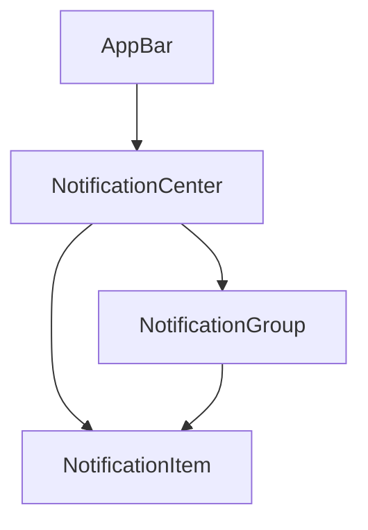

| Component          | Purpose                                                                                    |
| ------------------ | ------------------------------------------------------------------------------------------ |
| NotificationCenter | Popover panel triggered from AppBar bell icon with filter tabs, grouping, and bulk actions |
| NotificationGroup  | Collapsible group of related notifications sharing a `groupKey` (e.g., same repo/type)     |
| NotificationItem   | Individual notification row with category icon, priority color, relative time, and dismiss |

#### NotificationCenter (`components/notifications/NotificationCenter.tsx`)

Main notification panel rendered as a Radix Popover anchored to a bell icon in the AppBar. Provides filtering (All, Unread), notification grouping by `groupKey`, mark-all-read, and clear-all actions. Connects to `useNotificationStore` for state.

**Props:**
| Prop | Type | Description |
|------|------|-------------|
| `onNavigate` | `(screen: string, context?: string) => void` | Optional callback to navigate to a screen when a notification with `actionScreen` is clicked |

**Features:**

- Unread count badge on bell icon (capped at 99+)
- Do Not Disturb indicator (BellOff icon)
- Filter tabs: All, Unread
- Grouped notifications expand/collapse via NotificationGroup
- Mark all read and clear all bulk actions

#### NotificationItem (`components/notifications/NotificationItem.tsx`)

Single notification display with category-specific icon (GitPullRequest, CircleDot, Workflow, GitBranch, Monitor, Plug), priority-based left border color (red=high, yellow=medium, blue=low), relative timestamp, and dismiss button.

**Props:**
| Prop | Type | Description |
|------|------|-------------|
| `notification` | `AppNotification` | The notification data object |
| `onMarkRead` | `(id: string) => void` | Callback to mark as read |
| `onDismiss` | `(id: string) => void` | Callback to dismiss |
| `onClick` | `(notification: AppNotification) => void` | Optional click handler for navigation |

#### NotificationGroup (`components/notifications/NotificationGroup.tsx`)

Collapsible group header that shows the count of updates and unread badge for a given `groupKey`. When a group contains only one notification, it renders a single NotificationItem directly. When expanded, renders all grouped NotificationItems in an indented list.

**Props:**
| Prop | Type | Description |
|------|------|-------------|
| `groupKey` | `string` | The group identifier (e.g., `owner/repo/PullRequest`) |
| `notifications` | `AppNotification[]` | Notifications in this group |
| `onMarkRead` | `(id: string) => void` | Callback to mark as read |
| `onDismiss` | `(id: string) => void` | Callback to dismiss |
| `onClick` | `(notification: AppNotification) => void` | Optional click handler |

## Component Statistics

| Category      | Count   |
| ------------- | ------- |
| Screens       | 8       |
| Layout        | 3       |
| UI Base       | 22      |
| Dashboard     | 7       |
| Contributions | 4       |
| Issues        | 9       |
| Pull Requests | 5       |
| Branches      | 1       |
| Projects      | 8       |
| Tools         | 50      |
| Settings      | 8       |
| Spotify       | 7       |
| Discord       | 19      |
| Documentation | 3       |
| Updates       | 1       |
| Shared        | 2       |
| Notifications | 3       |
| **Total**     | **164** |

---

**Generated by:** APO (Documentation Specialist)
**Source:** JUNO Audit Report 2026-02-11
