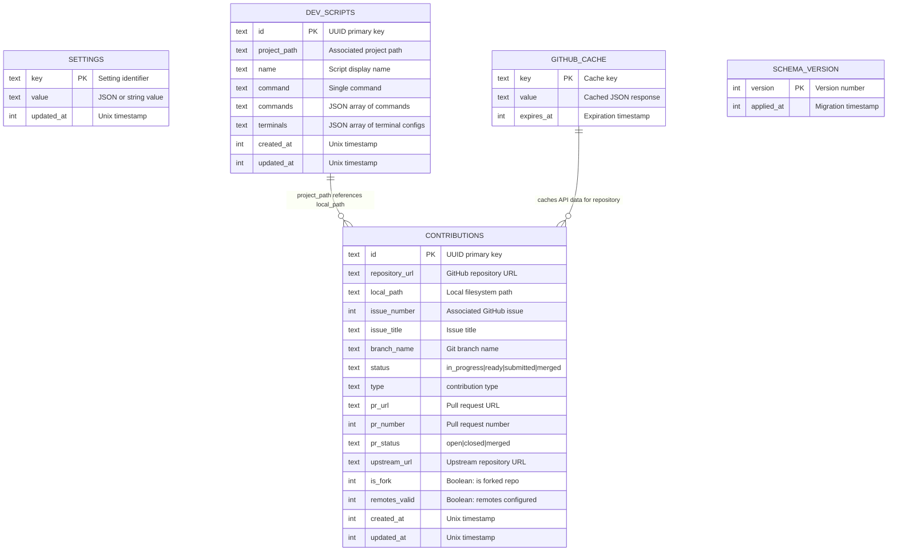
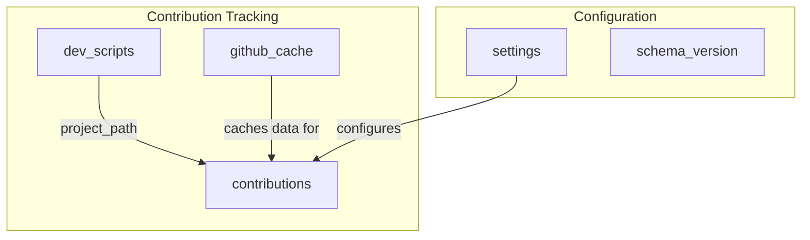

# Database Schema

## Overview

Cola Records uses SQLite with better-sqlite3 for local data persistence. The database stores contribution tracking data, application settings, API cache, and development scripts.

**Database Type:** SQLite (better-sqlite3)
**Schema Version:** 6
**Location:** Application data directory

## Entity Relationship Diagram



## Tables

### contributions

Primary table for tracking open source contributions.

| Column         | Type    | Constraints            | Description                    |
| -------------- | ------- | ---------------------- | ------------------------------ |
| id             | TEXT    | PRIMARY KEY            | UUID identifier                |
| repository_url | TEXT    | NOT NULL               | GitHub repository URL          |
| local_path     | TEXT    | NOT NULL               | Local clone directory          |
| issue_number   | INTEGER | NOT NULL               | GitHub issue number            |
| issue_title    | TEXT    | NOT NULL               | Issue title for display        |
| branch_name    | TEXT    | NOT NULL               | Working branch name            |
| status         | TEXT    | NOT NULL               | Workflow status                |
| type           | TEXT    | DEFAULT 'contribution' | Contribution type              |
| pr_url         | TEXT    | NULLABLE               | Pull request URL               |
| pr_number      | INTEGER | NULLABLE               | Pull request number            |
| pr_status      | TEXT    | NULLABLE               | PR status (open/closed/merged) |
| upstream_url   | TEXT    | NULLABLE               | Original repository URL        |
| is_fork        | INTEGER | DEFAULT 0              | Is forked repository           |
| remotes_valid  | INTEGER | DEFAULT 0              | Git remotes configured         |
| created_at     | INTEGER | NOT NULL               | Creation timestamp             |
| updated_at     | INTEGER | NOT NULL               | Last update timestamp          |

**Indexes:**

- `idx_contributions_status` - Fast filtering by status
- `idx_contributions_created_at` - Chronological sorting

**Status Values:**

- `in_progress` - Actively working on contribution
- `ready` - Ready for pull request
- `submitted` - Pull request created
- `merged` - Pull request merged

### settings

Key-value store for application settings.

| Column     | Type    | Constraints | Description                 |
| ---------- | ------- | ----------- | --------------------------- |
| key        | TEXT    | PRIMARY KEY | Setting identifier          |
| value      | TEXT    | NOT NULL    | Setting value (may be JSON) |
| updated_at | INTEGER | NOT NULL    | Last update timestamp       |

**Common Settings:**

- `github_token` - Encrypted GitHub personal access token
- `default_clone_path` - Default directory for cloning repos
- `theme` - Application theme preference
- `ssh_remotes` - SSH remote configurations

### github_cache

Time-based cache for GitHub API responses to reduce rate limiting.

| Column     | Type    | Constraints | Description                   |
| ---------- | ------- | ----------- | ----------------------------- |
| key        | TEXT    | PRIMARY KEY | Cache key (URL + params hash) |
| value      | TEXT    | NOT NULL    | Cached JSON response          |
| expires_at | INTEGER | NOT NULL    | Expiration timestamp          |

**Index:**

- `idx_github_cache_expires_at` - Efficient cache cleanup

**Caching Strategy:**

- Default TTL: 24 hours
- Automatic cleanup of expired entries
- Cache invalidation on write operations

### dev_scripts

Stores custom development scripts for projects.

| Column       | Type    | Constraints | Description                    |
| ------------ | ------- | ----------- | ------------------------------ |
| id           | TEXT    | PRIMARY KEY | UUID identifier                |
| project_path | TEXT    | NOT NULL    | Associated project directory   |
| name         | TEXT    | NOT NULL    | Display name for script        |
| command      | TEXT    | NOT NULL    | Single shell command           |
| commands     | TEXT    | NULLABLE    | JSON array of commands         |
| terminals    | TEXT    | NULLABLE    | JSON array of terminal configs |
| created_at   | INTEGER | NOT NULL    | Creation timestamp             |
| updated_at   | INTEGER | NOT NULL    | Last update timestamp          |

**Constraints:**

- `UNIQUE(project_path, name)` - One script name per project

**Index:**

- `idx_dev_scripts_project_path` - Fast lookup by project

**Terminal Config Structure:**

```json
{
  "name": "Terminal Name",
  "command": "npm run dev",
  "cwd": "/path/to/project"
}
```

### schema_version

Tracks database migrations for version management.

| Column     | Type    | Constraints | Description           |
| ---------- | ------- | ----------- | --------------------- |
| version    | INTEGER | PRIMARY KEY | Schema version number |
| applied_at | INTEGER | NOT NULL    | Migration timestamp   |

**Migration Process:**

1. Check current schema version
2. Apply pending migrations sequentially
3. Record each migration in schema_version
4. Rollback on failure

## Data Relationships



## Query Patterns

### Common Queries

**Get active contributions:**

```sql
SELECT * FROM contributions
WHERE status IN ('in_progress', 'ready')
ORDER BY updated_at DESC;
```

**Get cached GitHub data:**

```sql
SELECT value FROM github_cache
WHERE key = ? AND expires_at > ?;
```

**Get project scripts:**

```sql
SELECT * FROM dev_scripts
WHERE project_path = ?
ORDER BY name;
```

**Clean expired cache:**

```sql
DELETE FROM github_cache
WHERE expires_at < ?;
```

## Data Integrity

- **Foreign Keys:** Not enforced (SQLite default) - logical relationships only
- **Unique Constraints:** Applied on settings.key, dev_scripts(project_path, name)
- **Indexes:** Optimized for common query patterns
- **Timestamps:** Unix timestamps for consistency

---

**Generated by:** APO (Documentation Specialist)
**Source:** JUNO Audit Report 2026-02-11
**Schema Version:** 6
