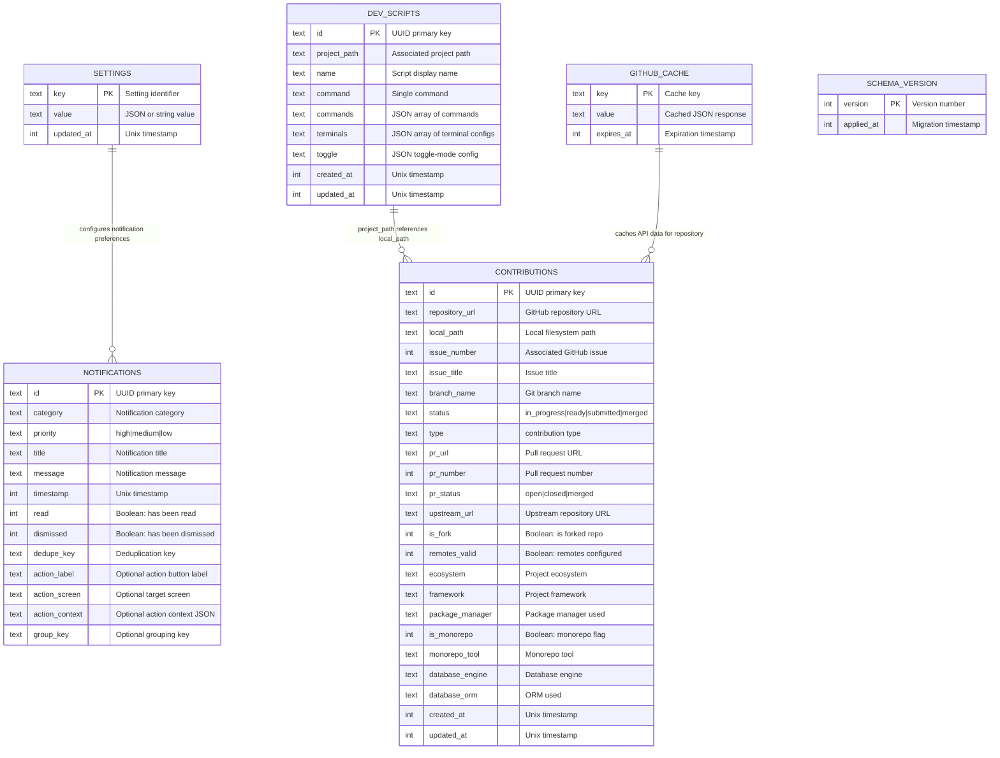
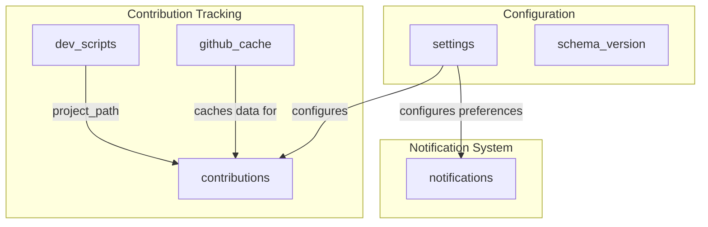

# Database Schema

## Overview

Cola Records uses SQLite with better-sqlite3 for local data persistence. The database stores contribution tracking data, application settings, API cache, development scripts, and notifications across 6 tables.

**Database Type:** SQLite (better-sqlite3)
**Schema Version:** 9
**Location:** Application data directory

## Entity Relationship Diagram



## Tables

### contributions

Primary table for tracking open source contributions.

| Column          | Type    | Constraints            | Description                             |
| --------------- | ------- | ---------------------- | --------------------------------------- |
| id              | TEXT    | PRIMARY KEY            | UUID identifier                         |
| repository_url  | TEXT    | NOT NULL               | GitHub repository URL                   |
| local_path      | TEXT    | NOT NULL               | Local clone directory                   |
| issue_number    | INTEGER | NOT NULL               | GitHub issue number                     |
| issue_title     | TEXT    | NOT NULL               | Issue title for display                 |
| branch_name     | TEXT    | NOT NULL               | Working branch name                     |
| status          | TEXT    | NOT NULL               | Workflow status                         |
| type            | TEXT    | DEFAULT 'contribution' | Contribution type                       |
| pr_url          | TEXT    | NULLABLE               | Pull request URL                        |
| pr_number       | INTEGER | NULLABLE               | Pull request number                     |
| pr_status       | TEXT    | NULLABLE               | PR status (open/closed/merged)          |
| upstream_url    | TEXT    | NULLABLE               | Original repository URL                 |
| is_fork         | INTEGER | DEFAULT 0              | Is forked repository                    |
| remotes_valid   | INTEGER | DEFAULT 0              | Git remotes configured                  |
| ecosystem       | TEXT    | NULLABLE               | Project ecosystem (e.g., node, python)  |
| framework       | TEXT    | NULLABLE               | Project framework (e.g., react, django) |
| package_manager | TEXT    | NULLABLE               | Package manager (e.g., npm, yarn)       |
| is_monorepo     | INTEGER | DEFAULT 0              | Monorepo flag                           |
| monorepo_tool   | TEXT    | NULLABLE               | Monorepo tool (e.g., nx, turborepo)     |
| database_engine | TEXT    | NULLABLE               | Database engine used                    |
| database_orm    | TEXT    | NULLABLE               | ORM used                                |
| created_at      | INTEGER | NOT NULL               | Creation timestamp                      |
| updated_at      | INTEGER | NOT NULL               | Last update timestamp                   |

**Indexes:**

- `idx_contributions_status` - Fast filtering by status
- `idx_contributions_created_at` - Chronological sorting

**Status Values:**

- `in_progress` - Actively working on contribution
- `ready` - Ready for pull request
- `submitted` - Pull request created
- `merged` - Pull request merged

### settings

Key-value store for application settings.

| Column     | Type    | Constraints | Description                 |
| ---------- | ------- | ----------- | --------------------------- |
| key        | TEXT    | PRIMARY KEY | Setting identifier          |
| value      | TEXT    | NOT NULL    | Setting value (may be JSON) |
| updated_at | INTEGER | NOT NULL    | Last update timestamp       |

**Common Settings:**

- `github_token` - Encrypted GitHub personal access token
- `default_clone_path` - Default directory for cloning repos
- `theme` - Application theme preference
- `ssh_remotes` - SSH remote configurations

### github_cache

Time-based cache for GitHub API responses to reduce rate limiting.

| Column     | Type    | Constraints | Description                   |
| ---------- | ------- | ----------- | ----------------------------- |
| key        | TEXT    | PRIMARY KEY | Cache key (URL + params hash) |
| value      | TEXT    | NOT NULL    | Cached JSON response          |
| expires_at | INTEGER | NOT NULL    | Expiration timestamp          |

**Index:**

- `idx_github_cache_expires_at` - Efficient cache cleanup

**Caching Strategy:**

- Default TTL: 24 hours
- Automatic cleanup of expired entries
- Cache invalidation on write operations

### dev_scripts

Stores custom development scripts for projects.

| Column       | Type    | Constraints | Description                    |
| ------------ | ------- | ----------- | ------------------------------ |
| id           | TEXT    | PRIMARY KEY | UUID identifier                |
| project_path | TEXT    | NOT NULL    | Associated project directory   |
| name         | TEXT    | NOT NULL    | Display name for script        |
| command      | TEXT    | NOT NULL    | Single shell command           |
| commands     | TEXT    | NULLABLE    | JSON array of commands         |
| terminals    | TEXT    | NULLABLE    | JSON array of terminal configs |
| toggle       | TEXT    | NULLABLE    | JSON toggle-mode config        |
| created_at   | INTEGER | NOT NULL    | Creation timestamp             |
| updated_at   | INTEGER | NOT NULL    | Last update timestamp          |

**Constraints:**

- `UNIQUE(project_path, name)` - One script name per project

**Index:**

- `idx_dev_scripts_project_path` - Fast lookup by project

**Terminal Config Structure:**

```json
{
  "name": "Terminal Name",
  "command": "npm run dev",
  "cwd": "/path/to/project"
}
```

### notifications

Stores persistent notifications for GitHub events, CI status, and application alerts.

| Column         | Type    | Constraints                                 | Description                      |
| -------------- | ------- | ------------------------------------------- | -------------------------------- |
| id             | TEXT    | PRIMARY KEY                                 | UUID identifier                  |
| category       | TEXT    | NOT NULL                                    | Notification category            |
| priority       | TEXT    | NOT NULL, CHECK(IN ('high','medium','low')) | Notification priority level      |
| title          | TEXT    | NOT NULL                                    | Notification title               |
| message        | TEXT    | NOT NULL                                    | Notification message body        |
| timestamp      | INTEGER | NOT NULL                                    | Creation timestamp               |
| read           | INTEGER | NOT NULL, DEFAULT 0                         | Has been read (0=unread, 1=read) |
| dismissed      | INTEGER | NOT NULL, DEFAULT 0                         | Has been dismissed               |
| dedupe_key     | TEXT    | NOT NULL                                    | Deduplication key                |
| action_label   | TEXT    | NULLABLE                                    | Action button label              |
| action_screen  | TEXT    | NULLABLE                                    | Target screen for action         |
| action_context | TEXT    | NULLABLE                                    | JSON context for action          |
| group_key      | TEXT    | NULLABLE                                    | Grouping key for display         |

**Indexes:**

- `idx_notifications_timestamp` - Chronological sorting
- `idx_notifications_read` - Fast filtering by read status
- `idx_notifications_dedupe_key` - Efficient deduplication checks
- `idx_notifications_category` - Filtering by category

**Deduplication Strategy:**

- Uses `INSERT OR IGNORE` with unique `dedupe_key` to prevent duplicate notifications
- Deduplication key is typically composed of event type + entity ID (e.g., `pr-review:owner/repo#123`)

**Toggle Config Structure:**

```json
{
  "onCommand": "npm run dev",
  "offCommand": "kill-port 3000",
  "isOn": false
}
```

### schema_version

Tracks database migrations for version management.

| Column     | Type    | Constraints | Description           |
| ---------- | ------- | ----------- | --------------------- |
| version    | INTEGER | PRIMARY KEY | Schema version number |
| applied_at | INTEGER | NOT NULL    | Migration timestamp   |

**Migration Process:**

1. Check current schema version
2. Apply pending migrations sequentially
3. Record each migration in schema_version
4. Rollback on failure

## Data Relationships



## Query Patterns

### Common Queries

**Get active contributions:**

```sql
SELECT * FROM contributions
WHERE status IN ('in_progress', 'ready')
ORDER BY updated_at DESC;
```

**Get cached GitHub data:**

```sql
SELECT value FROM github_cache
WHERE key = ? AND expires_at > ?;
```

**Get project scripts:**

```sql
SELECT * FROM dev_scripts
WHERE project_path = ?
ORDER BY name;
```

**Clean expired cache:**

```sql
DELETE FROM github_cache
WHERE expires_at < ?;
```

**Get unread notifications:**

```sql
SELECT * FROM notifications
WHERE read = 0 AND dismissed = 0
ORDER BY timestamp DESC
LIMIT ? OFFSET ?;
```

**Get unread notification count:**

```sql
SELECT COUNT(*) as count FROM notifications
WHERE read = 0 AND dismissed = 0;
```

**Mark notification as read:**

```sql
UPDATE notifications SET read = 1 WHERE id = ?;
```

**Mark all as read:**

```sql
UPDATE notifications SET read = 1 WHERE read = 0;
```

**Dismiss notification:**

```sql
UPDATE notifications SET dismissed = 1 WHERE id = ?;
```

**Cleanup old notifications:**

```sql
DELETE FROM notifications WHERE timestamp < ?;
```

## Data Integrity

- **Foreign Keys:** Not enforced (SQLite default) - logical relationships only
- **Unique Constraints:** Applied on settings.key, dev_scripts(project_path, name)
- **Check Constraints:** contributions.status, contributions.pr_status, notifications.priority
- **Indexes:** Optimized for common query patterns
- **Timestamps:** Unix timestamps for consistency
- **Deduplication:** notifications use `INSERT OR IGNORE` with `dedupe_key`

---

**Generated by:** APO (Documentation Specialist)
**Source:** JUNO Audit Report 2026-02-11
**Schema Version:** 9
