# Application Architecture Flow

## Overview

Cola Records is an Electron desktop application with a clear separation between the Main Process (Node.js) and Renderer Process (React). Communication between these processes occurs through a secure IPC (Inter-Process Communication) bridge via the preload script.

**Architecture Type:** Electron Main/Renderer with IPC Bridge

**Entry Points:**

- Main Process: `src/main/index.ts`
- Renderer: `src/renderer/index.tsx`
- Preload: `src/main/preload.ts`

## Architecture Diagram

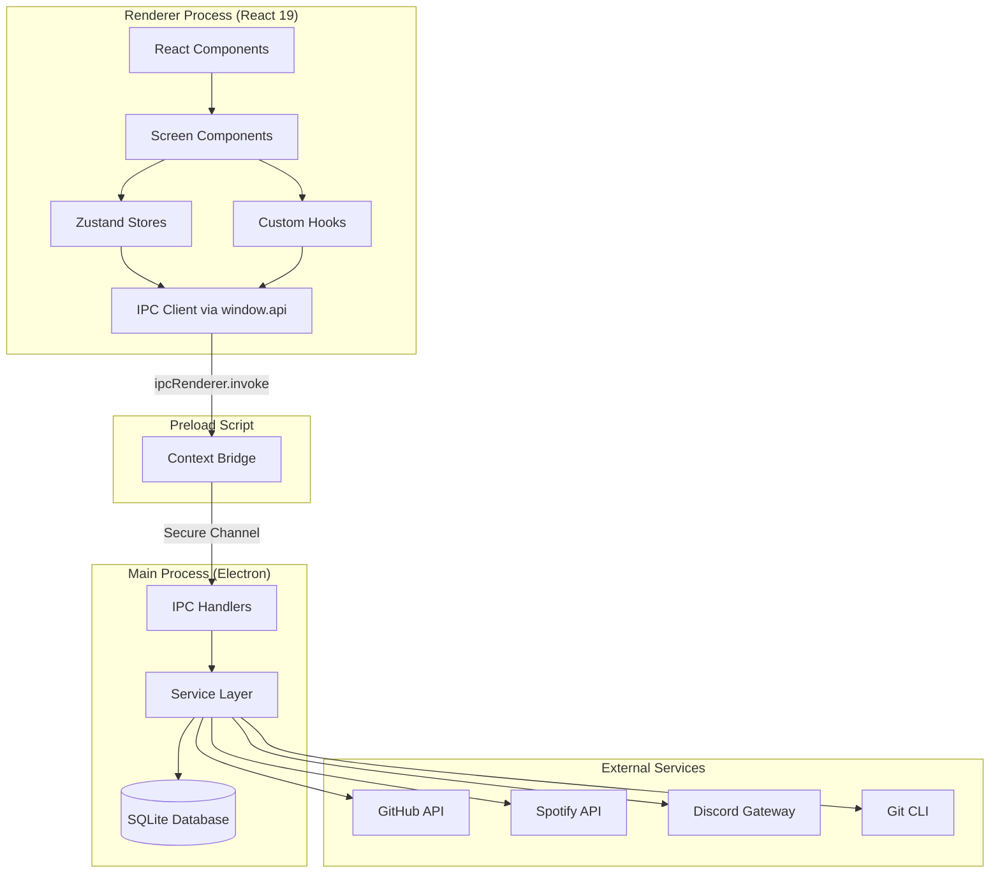

## Detailed Data Flow

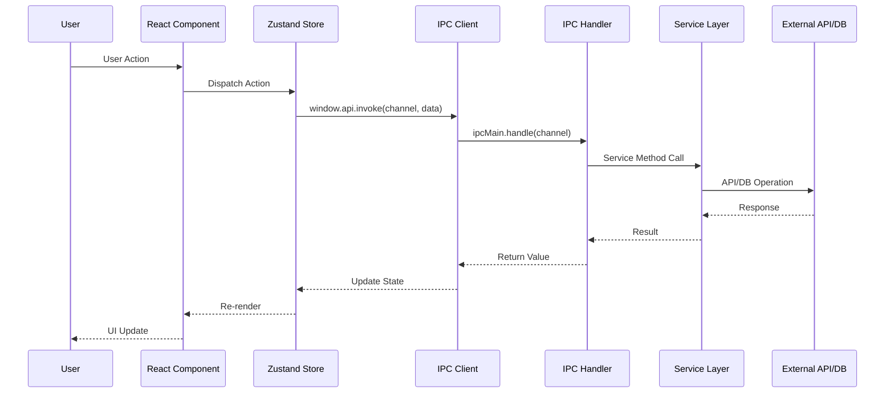

## Key Data Flows

### Contribution Workflow

```mermaid
graph LR
    subgraph Discovery["Issue Discovery"]
        Search[Search GitHub Issues]
        Filter[Filter by Labels/Language]
        Select[Select Issue]
    end

    subgraph Setup["Contribution Setup"]
        Fork[Fork Repository]
        Clone[Clone Locally]
        Branch[Create Branch]
    end

    subgraph Development["Development"]
        Code[Write Code]
        Commit[Commit Changes]
        Push[Push to Fork]
    end

    subgraph Submit["Submission"]
        PR[Create Pull Request]
        Track[Track PR Status]
        Merge[Merge/Close]
    end

    Search --> Filter --> Select
    Select --> Fork --> Clone --> Branch
    Branch --> Code --> Commit --> Push
    Push --> PR --> Track --> Merge
```

### Issue Discovery Flow

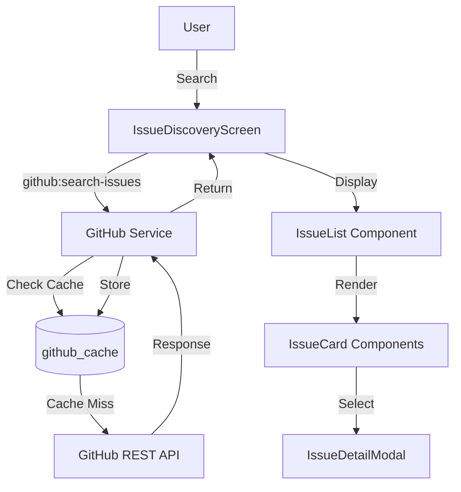

### Git Operations Flow

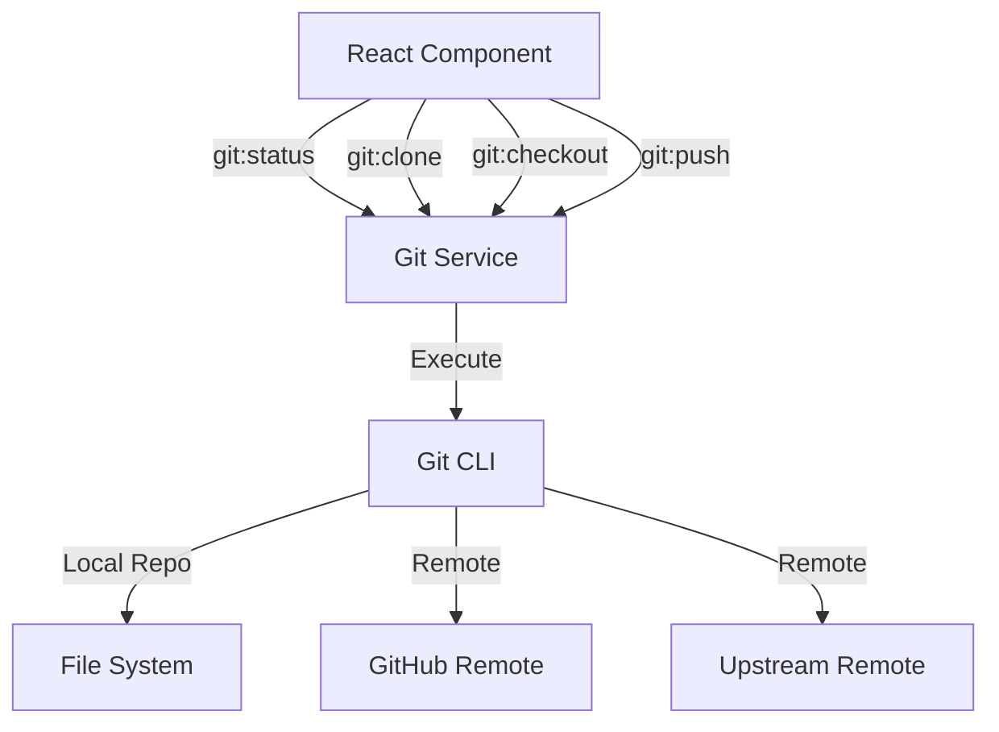

## IPC Channel Categories

| Category     | Prefix          | Channels | Purpose                   |
| ------------ | --------------- | -------- | ------------------------- |
| File System  | `fs:`           | 8        | Local file operations     |
| Git          | `git:`          | 17       | Git CLI operations        |
| GitHub       | `github:`       | 45       | GitHub API interactions   |
| Contribution | `contribution:` | 7        | Contribution CRUD         |
| Settings     | `settings:`     | 4        | Application settings      |
| Spotify      | `spotify:`      | 18       | Music playback            |
| Discord      | `discord:`      | 29       | Discord messaging         |
| Terminal     | `terminal:`     | 4        | PTY terminal              |
| Dev Scripts  | `dev-scripts:`  | 3        | Custom scripts            |
| Code Server  | `code-server:`  | 6        | VS Code server            |
| Updater      | `updater:`      | 5        | Auto-update functionality |
| Project      | `project:`      | 1        | Project scanning          |
| Gitignore    | `gitignore:`    | 2        | Git ignore operations     |
| Dialog       | `dialog:`       | 1        | Native dialogs            |
| Shell        | `shell:`        | 3        | Shell operations          |

## Service Layer

The Main Process contains 15 services handling specific domains:

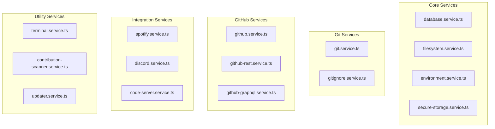

## State Management

Renderer process uses Zustand stores for state management:

| Store                        | Purpose                       |
| ---------------------------- | ----------------------------- |
| useContributionsStore        | Track active contributions    |
| useIssuesStore               | GitHub issue cache            |
| useProjectsStore             | Open source project tracking  |
| useProfessionalProjectsStore | Professional project tracking |
| useSettingsStore             | Application settings          |
| useSpotifyStore              | Spotify playback state        |
| useDiscordStore              | Discord connection state      |
| useDevScriptsStore           | Development scripts           |
| useOpenProjectsStore         | Currently open projects       |

---

## Multi-Project Architecture

Cola Records supports opening and managing multiple projects simultaneously through a tab-based interface. This architecture enables developers to work on several contributions without restarting the code-server container.

### Architecture Overview

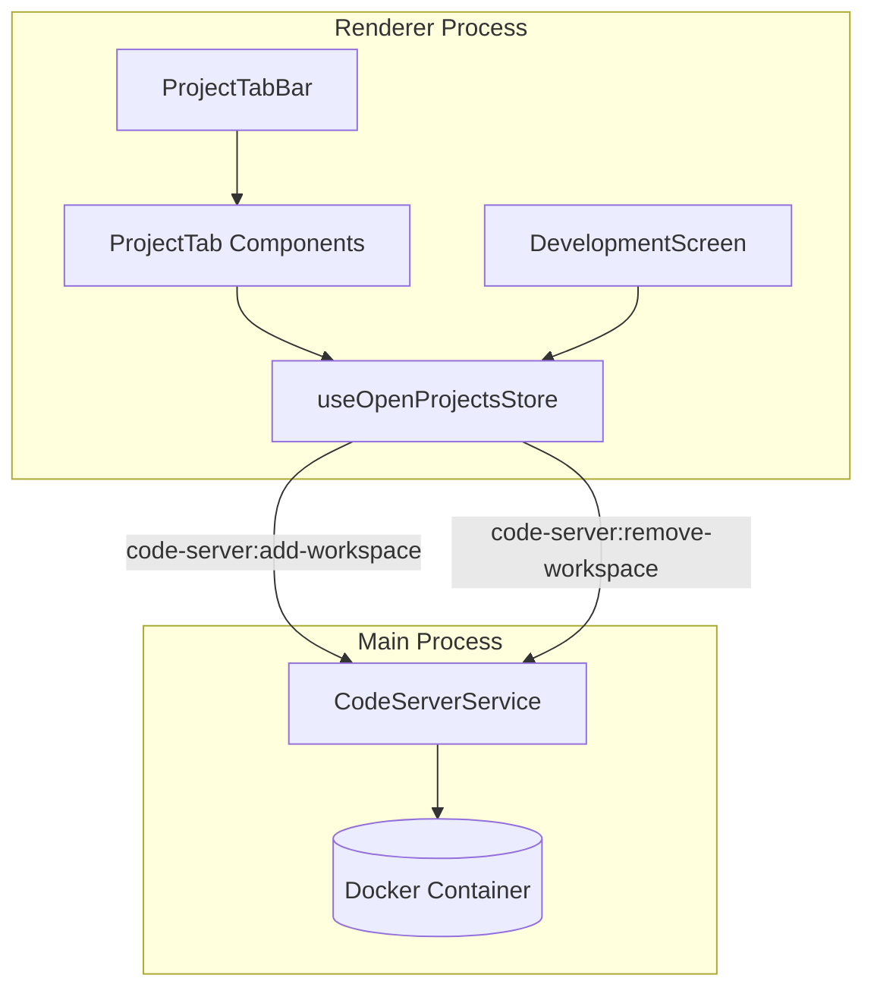

### State Management

The `useOpenProjectsStore` Zustand store manages open project state:

| Property          | Type             | Description                                |
| ----------------- | ---------------- | ------------------------------------------ |
| `projects`        | `OpenProject[]`  | Array of currently open projects           |
| `activeProjectId` | `string \| null` | ID of the currently visible project        |
| `maxProjects`     | `number`         | Maximum simultaneous projects (default: 5) |

### Project Lifecycle

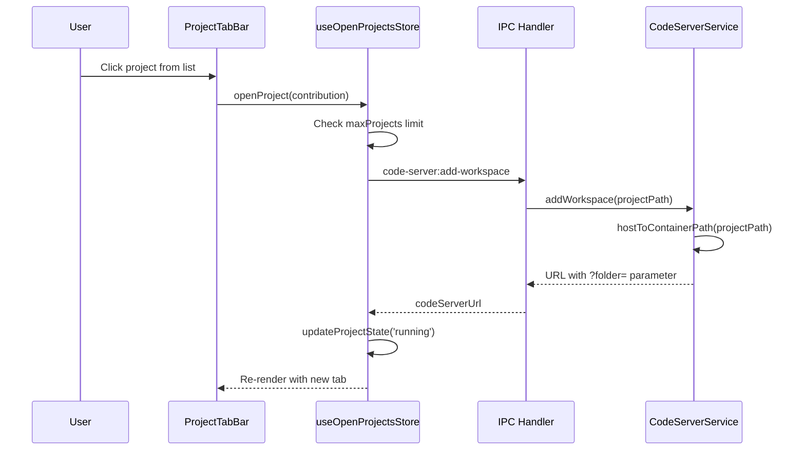

### Workspace Mounting Strategy

Rather than recreating Docker containers for each project, Cola Records mounts three workspace parent directories at container creation:

| Setting                           | Container Path                     | Purpose                        |
| --------------------------------- | ---------------------------------- | ------------------------------ |
| `defaultClonePath`                | `/config/workspaces/contributions` | Open-source contribution repos |
| `defaultProjectsPath`             | `/config/workspaces/my-projects`   | Personal projects              |
| `defaultProfessionalProjectsPath` | `/config/workspaces/professional`  | Professional/work projects     |

Project switching is handled via URL `?folder=` parameter, not container recreation. This preserves:

- Installed npm packages
- VS Code extensions
- Claude Code authentication
- Terminal history

### IPC Channels

| Channel                        | Direction        | Purpose                              |
| ------------------------------ | ---------------- | ------------------------------------ |
| `code-server:add-workspace`    | Renderer -> Main | Add project to tracking, get URL     |
| `code-server:remove-workspace` | Renderer -> Main | Remove project from tracking         |
| `code-server:start`            | Renderer -> Main | Start container with initial project |
| `code-server:stop`             | Renderer -> Main | Stop container (clears all projects) |

---

## Auto-Update Architecture

Cola Records uses `electron-updater` for automatic updates, providing seamless update delivery through GitHub Releases.

### Update Flow

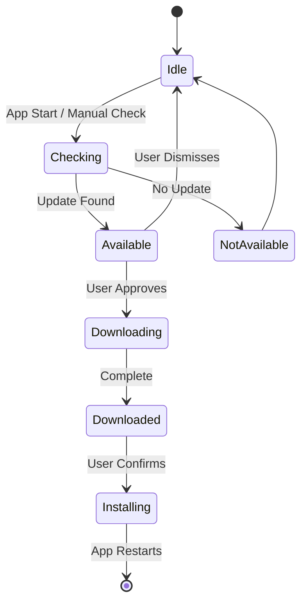

### UpdaterService Lifecycle

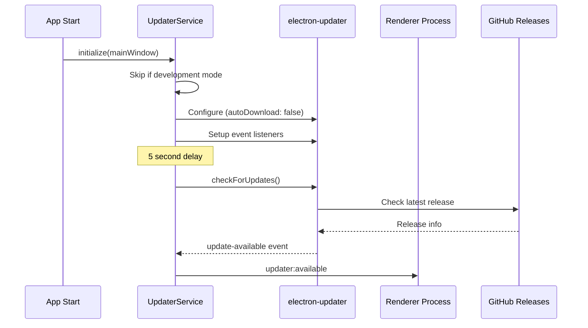

### Update States

| Status          | Description                        |
| --------------- | ---------------------------------- |
| `idle`          | No update activity                 |
| `checking`      | Checking GitHub for updates        |
| `available`     | Update found, awaiting user action |
| `not-available` | Current version is latest          |
| `downloading`   | Update downloading in background   |
| `downloaded`    | Ready to install                   |
| `error`         | Update check/download failed       |

### IPC Channels

| Channel                 | Direction        | Purpose                            |
| ----------------------- | ---------------- | ---------------------------------- |
| `updater:check`         | Renderer -> Main | Manually trigger update check      |
| `updater:download`      | Renderer -> Main | Start downloading available update |
| `updater:install`       | Renderer -> Main | Quit and install downloaded update |
| `updater:get-status`    | Renderer -> Main | Get current update state           |
| `updater:get-version`   | Renderer -> Main | Get current app version            |
| `updater:checking`      | Main -> Renderer | Update check started               |
| `updater:available`     | Main -> Renderer | Update available with version info |
| `updater:not-available` | Main -> Renderer | No update available                |
| `updater:progress`      | Main -> Renderer | Download progress (percent, bytes) |
| `updater:downloaded`    | Main -> Renderer | Update ready to install            |
| `updater:error`         | Main -> Renderer | Error occurred                     |

### Configuration

```typescript
// Auto-updater settings in UpdaterService
autoUpdater.autoDownload = false; // User must approve download
autoUpdater.autoInstallOnAppQuit = true; // Install on next quit if downloaded
```

---

## Terminal Architecture

Cola Records provides an integrated terminal using `node-pty` for pseudo-terminal emulation, allowing developers to run shell commands directly within the application.

### Architecture Overview

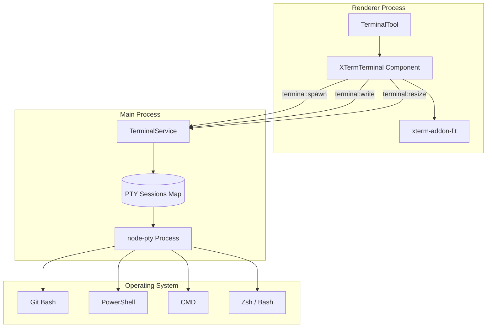

### PTY Lifecycle

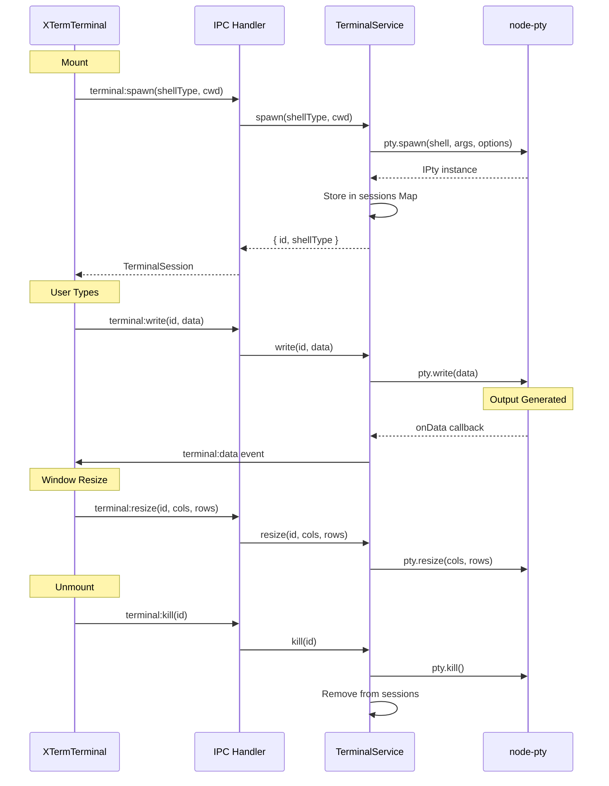

### Shell Type Selection

| Platform | Shell Type   | Executable Path                     |
| -------- | ------------ | ----------------------------------- |
| Windows  | `git-bash`   | `C:\Program Files\Git\bin\bash.exe` |
| Windows  | `powershell` | `powershell.exe`                    |
| Windows  | `cmd`        | `cmd.exe`                           |
| macOS    | Default      | `/bin/zsh`                          |
| Linux    | Default      | `/bin/bash`                         |

### PTY Configuration

```typescript
// Terminal spawn options
pty.spawn(shell, args, {
  name: 'xterm-256color', // Terminal type for color support
  cols: 80, // Initial columns
  rows: 24, // Initial rows
  cwd: workingDirectory, // Starting directory
  env: {
    ...process.env,
    TERM: 'xterm-256color',
  },
});
```

### IPC Channels

| Channel           | Direction        | Purpose                |
| ----------------- | ---------------- | ---------------------- |
| `terminal:spawn`  | Renderer -> Main | Create new PTY session |
| `terminal:write`  | Renderer -> Main | Send input to PTY      |
| `terminal:resize` | Renderer -> Main | Resize PTY dimensions  |
| `terminal:kill`   | Renderer -> Main | Terminate PTY session  |
| `terminal:data`   | Main -> Renderer | PTY output data        |
| `terminal:exit`   | Main -> Renderer | PTY process exited     |

### XTermTerminal Component Integration

The `XTermTerminal` component wraps xterm.js with:

- `xterm-addon-fit` for automatic terminal resizing
- `xterm-addon-webgl` for GPU-accelerated rendering
- Event listeners for IPC data and exit events
- Cleanup on component unmount

---

**Generated by:** APO (Documentation Specialist)
**Source:** JUNO Audit Report 2026-02-11
