# Application Architecture Flow

## Overview

Cola Records is an Electron desktop application with a clear separation between the Main Process (Node.js) and Renderer Process (React). Communication between these processes occurs through a secure IPC (Inter-Process Communication) bridge via the preload script.

**Architecture Type:** Electron Main/Renderer with IPC Bridge

**Entry Points:**

- Main Process: `src/main/index.ts`
- Renderer: `src/renderer/index.tsx`
- Preload: `src/main/preload.ts`

## Architecture Diagram

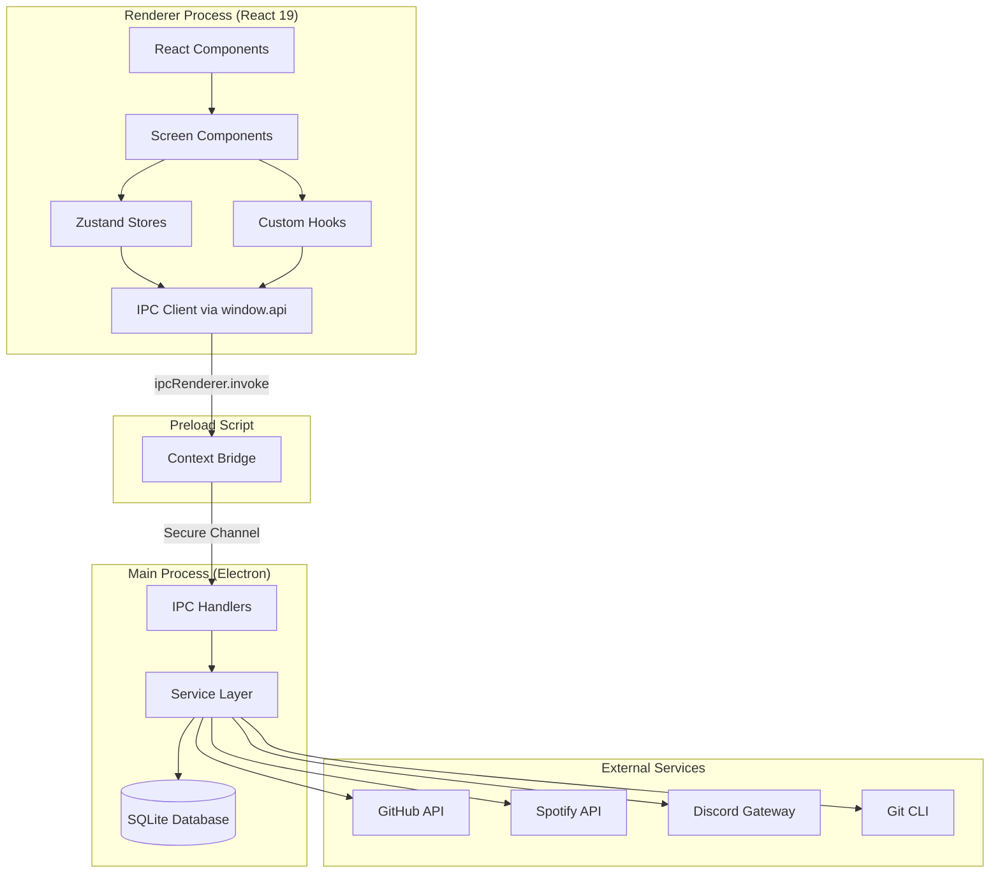

## Detailed Data Flow

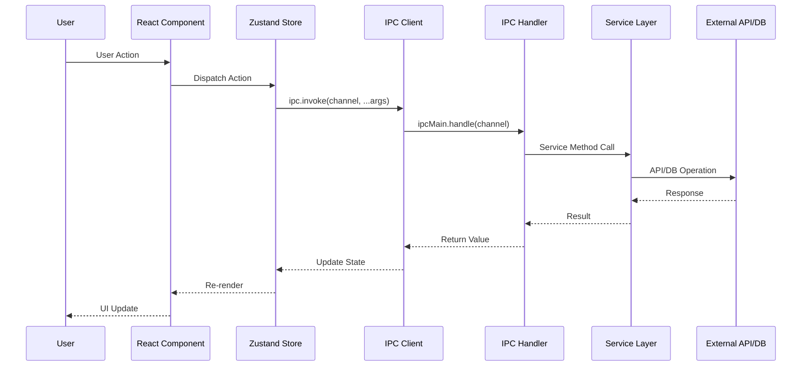

## Key Data Flows

### Contribution Workflow

```mermaid
graph LR
    subgraph Discovery["Issue Discovery"]
        Search[Search GitHub Issues]
        Filter[Filter by Labels/Language]
        Select[Select Issue]
    end

    subgraph Setup["Contribution Setup"]
        Fork[Fork Repository]
        Clone[Clone Locally]
        Branch[Create Branch]
    end

    subgraph Development["Development"]
        Code[Write Code]
        Commit[Commit Changes]
        Push[Push to Fork]
    end

    subgraph Submit["Submission"]
        PR[Create Pull Request]
        Track[Track PR Status]
        Merge[Merge/Close]
    end

    Search --> Filter --> Select
    Select --> Fork --> Clone --> Branch
    Branch --> Code --> Commit --> Push
    Push --> PR --> Track --> Merge
```

### Issue Discovery Flow

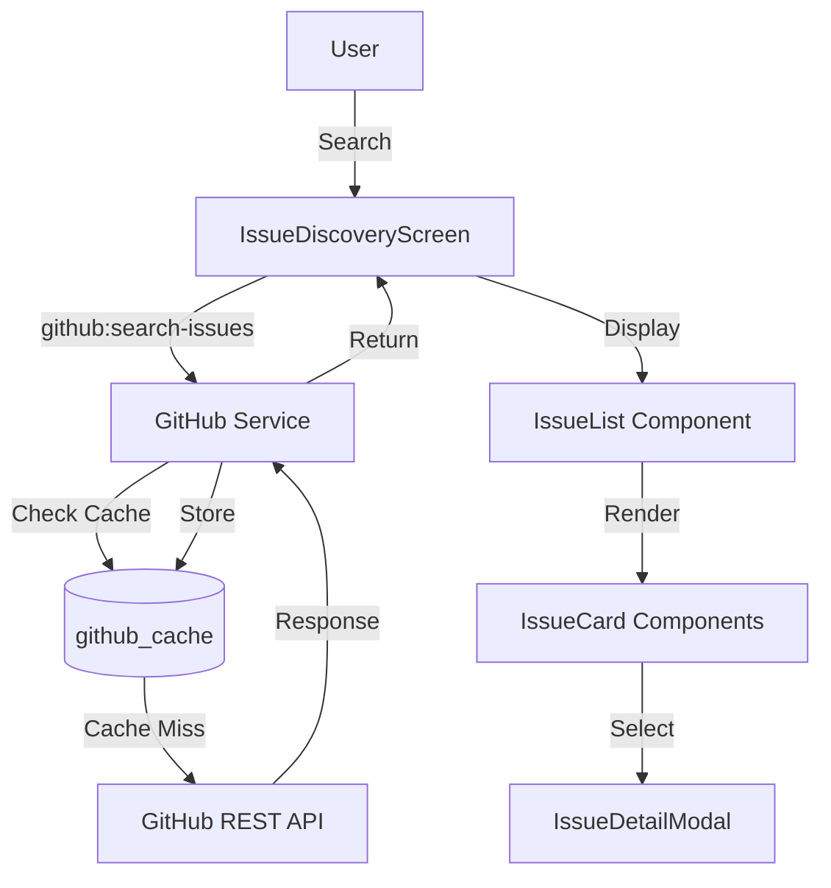

### Git Operations Flow

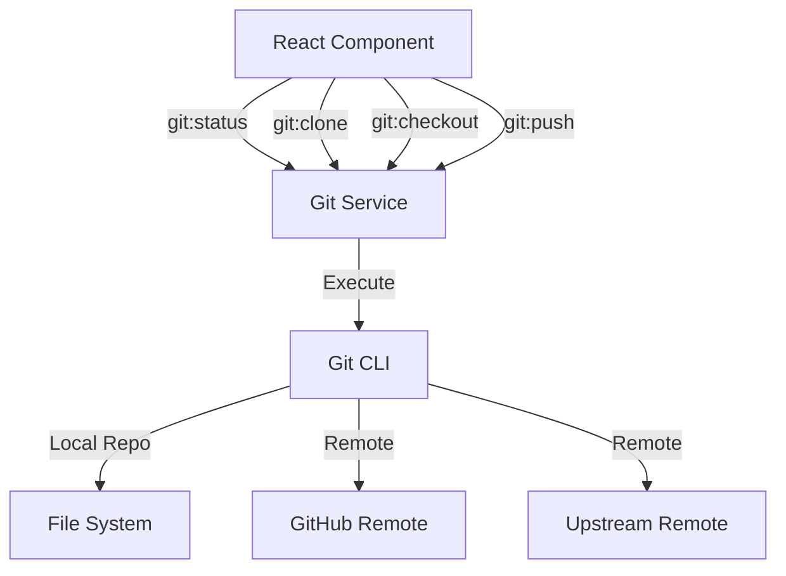

## IPC Channel Categories

| Category      | Prefix           | Channels | Purpose                        |
| ------------- | ---------------- | -------- | ------------------------------ |
| File System   | `fs:`            | 8        | Local file operations          |
| Git           | `git:`           | 21       | Git CLI operations             |
| GitHub        | `github:`        | 54       | GitHub API interactions        |
| Contribution  | `contribution:`  | 7        | Contribution CRUD              |
| Settings      | `settings:`      | 4        | Application settings           |
| Spotify       | `spotify:`       | 18       | Music playback                 |
| Discord       | `discord:`       | 29       | Discord messaging              |
| Terminal      | `terminal:`      | 5        | PTY terminal                   |
| Dev Scripts   | `dev-scripts:`   | 3        | Custom scripts                 |
| Code Server   | `code-server:`   | 7        | VS Code server                 |
| Updater       | `updater:`       | 5        | Auto-update functionality      |
| Project       | `project:`       | 9        | Project scanning and creation  |
| Gitignore     | `gitignore:`     | 2        | Git ignore operations          |
| Dialog        | `dialog:`        | 1        | Native dialogs                 |
| Shell         | `shell:`         | 3        | Shell operations               |
| Docs          | `docs:`          | 1        | Documentation file structure   |
| Dev Tools     | `dev-tools:`     | 61       | Development tool configuration |
| AI            | `ai:`            | 3        | AI/LLM integration             |
| Workflow      | `workflow:`      | 8        | AI-powered workflows           |
| Notification  | `notification:`  | 9        | Notification management        |
| GitHub Config | `github-config:` | 7        | GitHub repository config       |
| Echo          | `echo:`          | 1        | Echo test channel              |
| **Total**     |                  | **266**  | **+ 11 event channels**        |

## Service Layer

The Main Process contains 38 top-level services plus 9 domain-split sub-modules handling specific domains:

```mermaid
graph TD
    subgraph Core["Core Services"]
        Database[database.service.ts]
        FileSystem[filesystem.service.ts]
        Environment[environment.service.ts]
        SecureStorage[secure-storage.service.ts]
    end

    subgraph Git["Git Services"]
        GitService[git.service.ts]
        GitIgnore[gitignore.service.ts]
        GitAskpass[git-askpass.service.ts]
    end

    subgraph GitHub["GitHub Services"]
        GitHubMain[github.service.ts]
        GitHubREST[github-rest.service.ts]
        GitHubGraphQL[github-graphql.service.ts]
        GitHubConfig[github-config.service.ts]
        subgraph GitHubSplit["Domain-Split Modules (github/)"]
            GitHubIssues[github-issues.service.ts]
            GitHubPRs[github-pull-requests.service.ts]
            GitHubBase[github-rest-base.service.ts]
            GitHubExtras[github-extras.service.ts]
        end
    end

    subgraph Integrations["Integration Services"]
        Spotify[spotify.service.ts]
        Discord[discord.service.ts]
        CodeServer[code-server.service.ts]
        subgraph CodeServerSplit["Domain-Split Modules (code-server/)"]
            PathMapper[path-mapper.ts]
            ConfigSync[config-sync.ts]
            DockerOps[docker-ops.ts]
            CSTypes[types.ts]
        end
    end

    subgraph MaintenanceServices["Maintenance Services"]
        BuildConfig[build-config.service.ts]
        CoverageConfig[coverage-config.service.ts]
        EditorConfig[editorconfig.service.ts]
        EnvFile[env-file.service.ts]
        FormatConfig[format-config.service.ts]
        Hooks[hooks.service.ts]
        LintConfig[lint-config.service.ts]
        PackageConfig[package-config.service.ts]
        TestConfig[test-config.service.ts]
    end

    subgraph AIServices["AI Services"]
        AIService[ai.service.ts]
        WorkflowService[workflow.service.ts]
    end

    subgraph ProjectServices["Project Services"]
        ProjectDetection[project-detection.service.ts]
        ProjectScaffold[project-scaffold.service.ts]
        DatabaseScaffold[database-scaffold.service.ts]
        CLIDetection[cli-detection.service.ts]
        CLIScanner[cli-scanner.service.ts]
    end

    subgraph Notification["Notification"]
        NotificationService[notification.service.ts]
    end

    subgraph Utilities["Utility Services"]
        Terminal[terminal.service.ts]
        Scanner[contribution-scanner.service.ts]
        Updater[updater.service.ts]
        VersionService[version.service.ts]
        PackageManager[package-manager.service.ts]
        EnvScanner[env-scanner.service.ts]
        NpmRegistry[npm-registry.service.ts]
        DiskUsage[disk-usage.service.ts]
    end
```

> **Note:** The `github/` and `code-server/` subdirectories contain domain-split sub-modules that are re-exported through barrel files. The top-level service files delegate to these sub-modules for specific operations.

## State Management

Renderer process uses Zustand stores for state management:

| Store                        | Purpose                       |
| ---------------------------- | ----------------------------- |
| useContributionsStore        | Track active contributions    |
| useIssuesStore               | GitHub issue cache            |
| useProjectsStore             | Open source project tracking  |
| useProfessionalProjectsStore | Professional project tracking |
| useSettingsStore             | Application settings          |
| useSpotifyStore              | Spotify playback state        |
| useDiscordStore              | Discord connection state      |
| useDevScriptsStore           | Development scripts           |
| useOpenProjectsStore         | Currently open projects       |
| useUpdaterStore              | Auto-update state management  |
| useNotificationStore         | Notification state management |

---

## Multi-Project Architecture

Cola Records supports opening and managing multiple projects simultaneously through a tab-based interface. This architecture enables developers to work on several contributions without restarting the code-server container.

### Architecture Overview

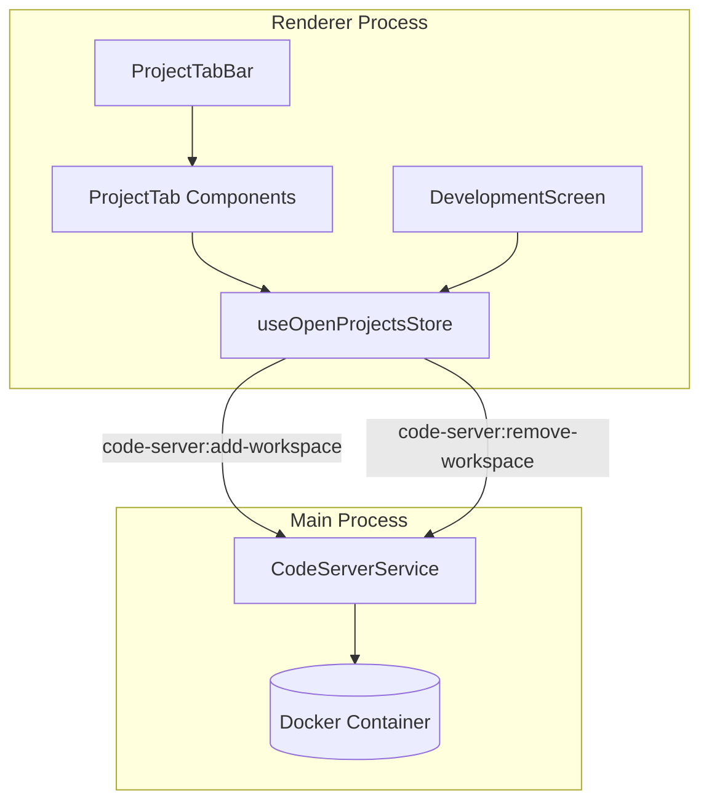

### State Management

The `useOpenProjectsStore` Zustand store manages open project state:

| Property          | Type             | Description                                |
| ----------------- | ---------------- | ------------------------------------------ |
| `projects`        | `OpenProject[]`  | Array of currently open projects           |
| `activeProjectId` | `string \| null` | ID of the currently visible project        |
| `maxProjects`     | `number`         | Maximum simultaneous projects (default: 5) |

### Project Lifecycle

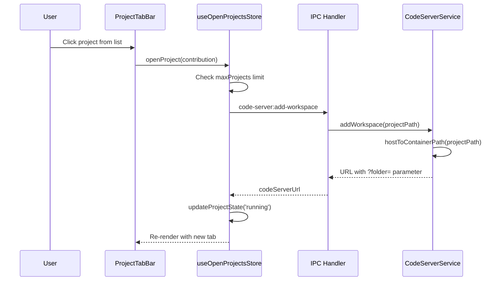

### Workspace Mounting Strategy

Rather than recreating Docker containers for each project, Cola Records mounts three workspace parent directories at container creation:

| Setting                           | Container Path                     | Purpose                        |
| --------------------------------- | ---------------------------------- | ------------------------------ |
| `defaultClonePath`                | `/config/workspaces/contributions` | Open-source contribution repos |
| `defaultProjectsPath`             | `/config/workspaces/my-projects`   | Personal projects              |
| `defaultProfessionalProjectsPath` | `/config/workspaces/professional`  | Professional/work projects     |

Project switching is handled via URL `?folder=` parameter, not container recreation. This preserves:

- Installed npm packages
- VS Code extensions
- Claude Code authentication
- Terminal history

### IPC Channels

| Channel                        | Direction        | Purpose                              |
| ------------------------------ | ---------------- | ------------------------------------ |
| `code-server:add-workspace`    | Renderer -> Main | Add project to tracking, get URL     |
| `code-server:remove-workspace` | Renderer -> Main | Remove project from tracking         |
| `code-server:start`            | Renderer -> Main | Start container with initial project |
| `code-server:stop`             | Renderer -> Main | Stop container (clears all projects) |

---

## Auto-Update Architecture

Cola Records uses `electron-updater` for automatic updates, providing seamless update delivery through GitHub Releases.

### Update Flow

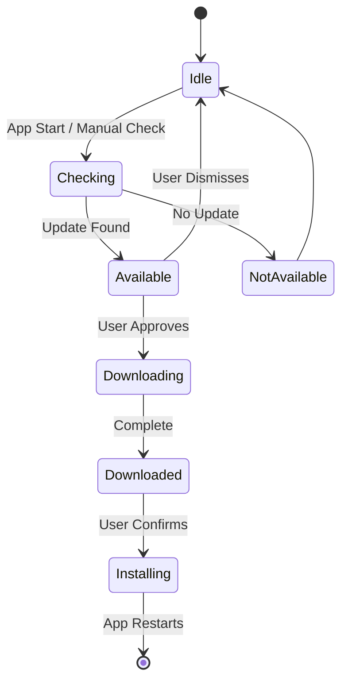

### UpdaterService Lifecycle

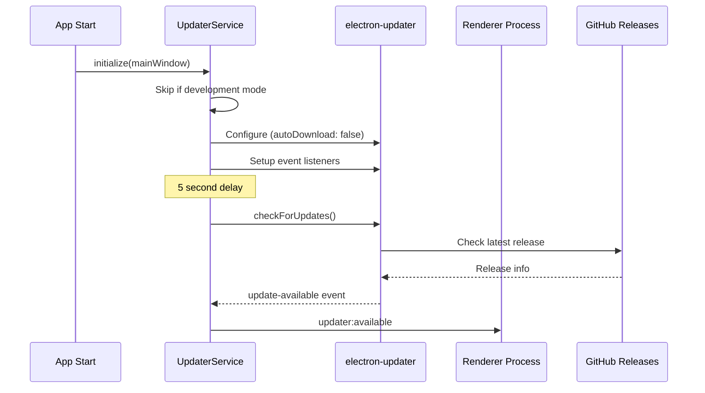

### Update States

| Status          | Description                        |
| --------------- | ---------------------------------- |
| `idle`          | No update activity                 |
| `checking`      | Checking GitHub for updates        |
| `available`     | Update found, awaiting user action |
| `not-available` | Current version is latest          |
| `downloading`   | Update downloading in background   |
| `downloaded`    | Ready to install                   |
| `error`         | Update check/download failed       |

### IPC Channels

| Channel                 | Direction        | Purpose                            |
| ----------------------- | ---------------- | ---------------------------------- |
| `updater:check`         | Renderer -> Main | Manually trigger update check      |
| `updater:download`      | Renderer -> Main | Start downloading available update |
| `updater:install`       | Renderer -> Main | Quit and install downloaded update |
| `updater:get-status`    | Renderer -> Main | Get current update state           |
| `updater:get-version`   | Renderer -> Main | Get current app version            |
| `updater:checking`      | Main -> Renderer | Update check started               |
| `updater:available`     | Main -> Renderer | Update available with version info |
| `updater:not-available` | Main -> Renderer | No update available                |
| `updater:progress`      | Main -> Renderer | Download progress (percent, bytes) |
| `updater:downloaded`    | Main -> Renderer | Update ready to install            |
| `updater:error`         | Main -> Renderer | Error occurred                     |

### Configuration

```typescript
// Auto-updater settings in UpdaterService
autoUpdater.autoDownload = false; // User must approve download
autoUpdater.autoInstallOnAppQuit = true; // Install on next quit if downloaded
```

---

## GitHub Actions Flow

Cola Records integrates with GitHub Actions to display workflow runs, jobs, and logs directly within the development tools panel.

### Data Flow

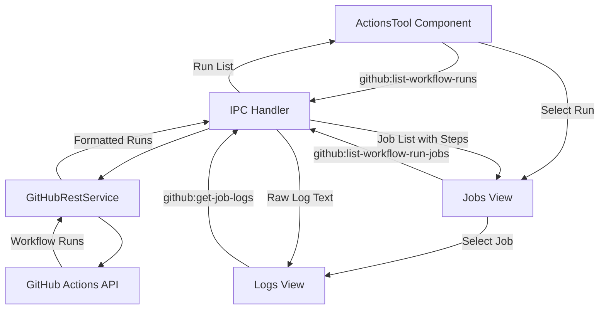

### IPC Channels

| Channel                         | Direction        | Purpose                       |
| ------------------------------- | ---------------- | ----------------------------- |
| `github:list-workflow-runs`     | Renderer -> Main | List workflow runs for a repo |
| `github:list-workflow-run-jobs` | Renderer -> Main | List jobs for a specific run  |
| `github:get-job-logs`           | Renderer -> Main | Get raw log output for a job  |

---

## GitHub Releases Flow

The releases management flow enables listing, creating, updating, deleting, and publishing releases directly from the development tools panel.

### Data Flow

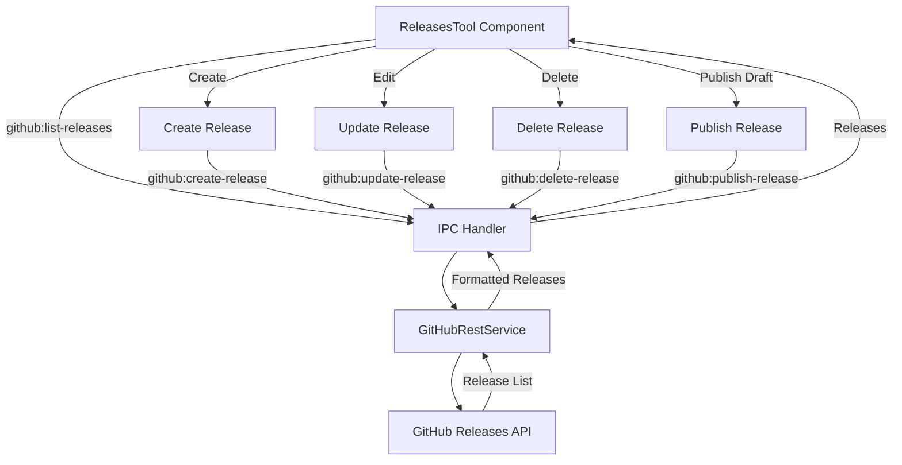

### IPC Channels

| Channel                  | Direction        | Purpose                      |
| ------------------------ | ---------------- | ---------------------------- |
| `github:list-releases`   | Renderer -> Main | List all releases for a repo |
| `github:get-release`     | Renderer -> Main | Get single release details   |
| `github:create-release`  | Renderer -> Main | Create a new release         |
| `github:update-release`  | Renderer -> Main | Update release metadata      |
| `github:delete-release`  | Renderer -> Main | Delete a release             |
| `github:publish-release` | Renderer -> Main | Publish a draft release      |

---

## Dashboard Data Flow

The DashboardScreen aggregates data from multiple GitHub API channels to populate six independent widgets. Each widget fetches its own data and manages loading, error, and empty states independently through the shared DashboardWidget wrapper.

### Data Flow

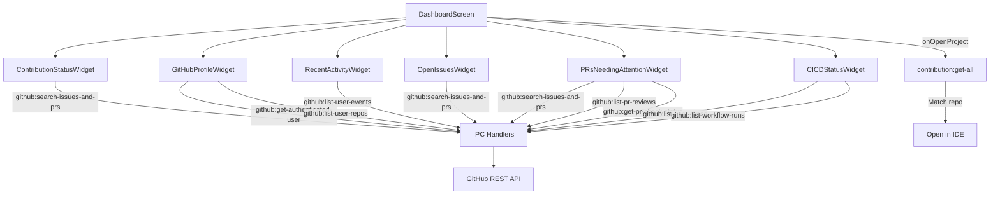

### Widget Data Sources

| Widget                    | IPC Channels Used                                                                            |
| ------------------------- | -------------------------------------------------------------------------------------------- |
| ContributionStatusWidget  | `github:search-issues-and-prs` (4 queries: open PRs, merged PRs, open issues, closed issues) |
| GitHubProfileWidget       | `github:get-authenticated-user`, `github:list-user-repos`                                    |
| RecentActivityWidget      | `github:get-authenticated-user`, `github:list-user-events`                                   |
| OpenIssuesWidget          | `github:get-authenticated-user`, `github:search-issues-and-prs` (assigned + authored)        |
| PRsNeedingAttentionWidget | `github:search-issues-and-prs`, `github:list-pr-reviews`, `github:get-pr-check-status`       |
| CICDStatusWidget          | `github:list-user-repos`, `github:list-workflow-runs`                                        |

---

## Documentation Viewer Flow

The DocumentationScreen provides an in-app markdown documentation viewer with mermaid diagram rendering. It loads the documentation file structure from the main process and renders selected files using ReactMarkdown.

### Data Flow

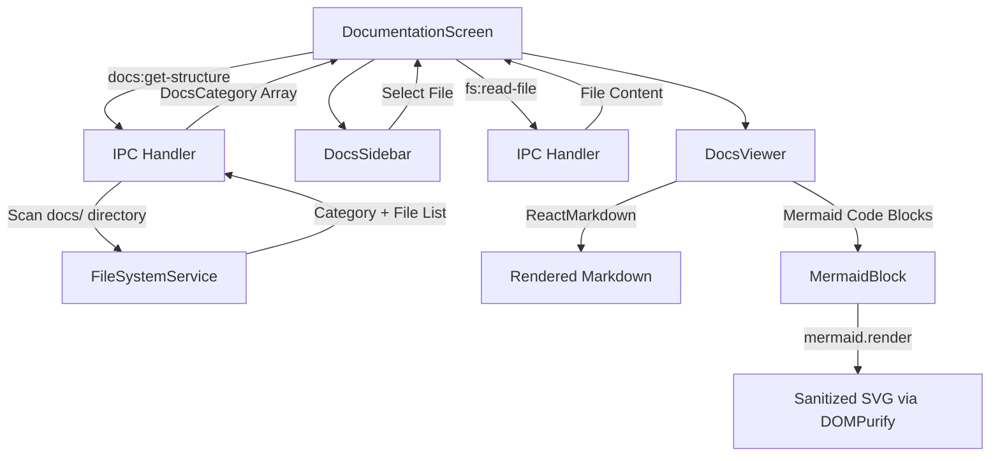

### Rendering Pipeline

1. **DocumentationScreen** mounts and invokes `docs:get-structure` to get categorized file list
2. **DocsSidebar** displays categories with expandable file lists
3. User selects a file; `fs:read-file` loads the raw markdown content
4. **DocsViewer** renders markdown via `ReactMarkdown` with `remarkGfm` and `rehypeRaw`
5. Code blocks with `language-mermaid` are intercepted and rendered by **MermaidBlock**
6. MermaidBlock uses `mermaid.render()` and sanitizes output SVG with `DOMPurify`

---

## Terminal Architecture

Cola Records provides an integrated terminal using `node-pty` for pseudo-terminal emulation, allowing developers to run shell commands directly within the application.

### Architecture Overview

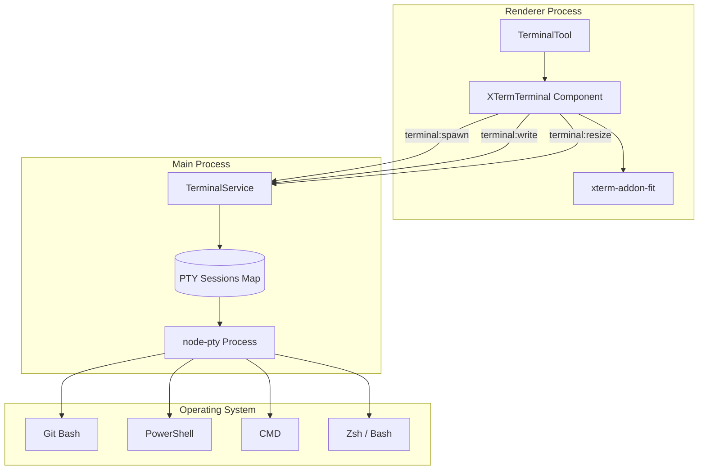

### PTY Lifecycle

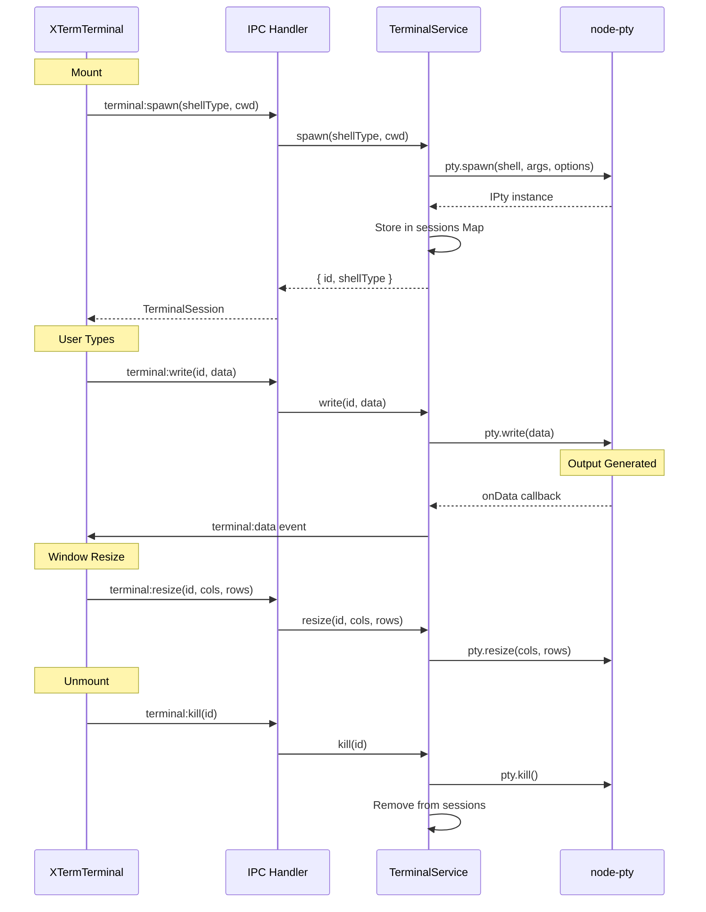

### Shell Type Selection

| Platform | Shell Type   | Executable Path                     |
| -------- | ------------ | ----------------------------------- |
| Windows  | `git-bash`   | `C:\Program Files\Git\bin\bash.exe` |
| Windows  | `powershell` | `powershell.exe`                    |
| Windows  | `cmd`        | `cmd.exe`                           |
| macOS    | Default      | `/bin/zsh`                          |
| Linux    | Default      | `/bin/bash`                         |

### PTY Configuration

```typescript
// Terminal spawn options
pty.spawn(shell, args, {
  name: 'xterm-256color', // Terminal type for color support
  cols: 80, // Initial columns
  rows: 24, // Initial rows
  cwd: workingDirectory, // Starting directory
  env: {
    ...process.env,
    TERM: 'xterm-256color',
  },
});
```

### IPC Channels

| Channel           | Direction        | Purpose                |
| ----------------- | ---------------- | ---------------------- |
| `terminal:spawn`  | Renderer -> Main | Create new PTY session |
| `terminal:write`  | Renderer -> Main | Send input to PTY      |
| `terminal:resize` | Renderer -> Main | Resize PTY dimensions  |
| `terminal:kill`   | Renderer -> Main | Terminate PTY session  |
| `terminal:data`   | Main -> Renderer | PTY output data        |
| `terminal:exit`   | Main -> Renderer | PTY process exited     |

### XTermTerminal Component Integration

The `XTermTerminal` component wraps xterm.js with:

- `xterm-addon-fit` for automatic terminal resizing
- `xterm-addon-webgl` for GPU-accelerated rendering
- Event listeners for IPC data and exit events
- Cleanup on component unmount

---

## Notification System Architecture

Cola Records includes a real-time notification system that polls GitHub for new events (PR reviews, CI failures, issue assignments) and pushes them to the renderer process. Notifications are persisted to SQLite and deduplicated via `dedupe_key`.

### Architecture Overview

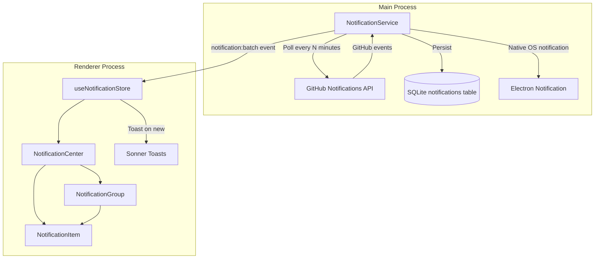

### Data Flow

1. **NotificationService** initializes with the main BrowserWindow and starts polling after a 10-second delay
2. Polls GitHub Notifications API at a configurable interval (default: 5 minutes)
3. Maps GitHub notification events to `AppNotification` objects with category (github-pr, github-issue, github-ci), priority (high, medium, low), and deduplication key
4. Persists each notification to the SQLite `notifications` table via `database.addNotification()`
5. Pushes a batch to the renderer via `notification:batch` event channel
6. Shows native OS notification (Electron `Notification`) when window is unfocused and preferences allow
7. **useNotificationStore** receives the batch, deduplicates against in-memory cache (max 300), updates unread count, and fires Sonner toasts
8. **NotificationCenter** renders notifications grouped by `groupKey` with filter tabs

### IPC Channels

| Channel                           | Direction        | Purpose                              |
| --------------------------------- | ---------------- | ------------------------------------ |
| `notification:add`                | Renderer -> Main | Add notification to DB               |
| `notification:get-all`            | Renderer -> Main | Fetch notifications with pagination  |
| `notification:mark-read`          | Renderer -> Main | Mark single notification as read     |
| `notification:mark-all-read`      | Renderer -> Main | Mark all as read                     |
| `notification:dismiss`            | Renderer -> Main | Dismiss a notification               |
| `notification:clear-all`          | Renderer -> Main | Clear all notifications              |
| `notification:get-preferences`    | Renderer -> Main | Get notification preferences         |
| `notification:update-preferences` | Renderer -> Main | Update preferences (deep merge)      |
| `notification:get-unread-count`   | Renderer -> Main | Get unread count                     |
| `notification:push`               | Main -> Renderer | Push single notification to renderer |
| `notification:batch`              | Main -> Renderer | Push batch of notifications          |

### Persistence Strategy

Notifications are stored in the `notifications` SQLite table with 13 columns including `dedupe_key` (unique constraint for deduplication) and `group_key` (for UI grouping). Old notifications are auto-purged after 30 days on service startup. The store maintains an in-memory cache of 300 notifications for fast rendering.

### Notification Categories

| Category       | Priority Mapping                                 | Icon           |
| -------------- | ------------------------------------------------ | -------------- |
| `github-pr`    | review_requested=high, mention=medium, other=low | GitPullRequest |
| `github-issue` | assign=medium, mention=medium, other=low         | CircleDot      |
| `github-ci`    | medium                                           | Workflow       |
| `git`          | low                                              | GitBranch      |
| `system`       | low                                              | Monitor        |
| `integration`  | low                                              | Plug           |

---

## Maintenance Tools Architecture

The Maintenance Tools system provides a comprehensive suite of development tool configuration management (hooks, formatters, linters, test frameworks, build tools, coverage, editorconfig, env files, and package management) through a detect-read-write pattern.

### Architecture Overview

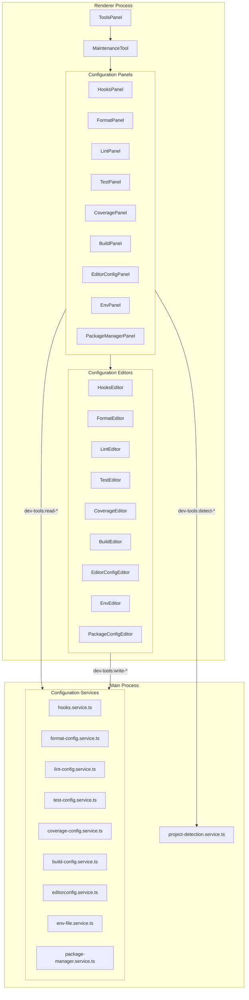

### Detect-Read-Write Pattern

Every configuration tool follows the same three-phase lifecycle:

1. **Detect**: The panel calls `dev-tools:detect-<tool>` to determine which tool is installed (e.g., which formatter: Prettier, Biome, dprint), its config file path, and whether it is properly configured
2. **Read**: Once detected, the panel calls `dev-tools:read-<tool>-config` to load the current configuration into an editor component
3. **Write**: The editor component calls `dev-tools:write-<tool>-config` to persist changes back to the configuration file

Each service also provides `get-<tool>-presets` for ecosystem-aware default configurations.

### Supported Tool Types

| Tool Type    | Service                      | Supported Tools                               |
| ------------ | ---------------------------- | --------------------------------------------- |
| Hooks        | `hooks.service.ts`           | Husky, pre-commit, Lefthook, simple-git-hooks |
| Formatters   | `format-config.service.ts`   | Prettier, Biome, dprint                       |
| Linters      | `lint-config.service.ts`     | ESLint, Biome, Ruff, Clippy                   |
| Test         | `test-config.service.ts`     | Vitest, Jest, Pytest, Cargo test              |
| Coverage     | `coverage-config.service.ts` | V8, Istanbul/nyc, C8, coverage.py             |
| Build        | `build-config.service.ts`    | Vite, Webpack, Rollup, esbuild, tsup          |
| EditorConfig | `editorconfig.service.ts`    | .editorconfig standard                        |
| Env Files    | `env-file.service.ts`        | .env, .env.example, .env.local                |
| Package Mgr  | `package-manager.service.ts` | npm, yarn, pnpm, bun, pip, poetry, cargo      |

---

## AI Integration Architecture

Cola Records integrates AI/LLM capabilities for automated content generation through a multi-provider abstraction layer.

### Architecture Overview

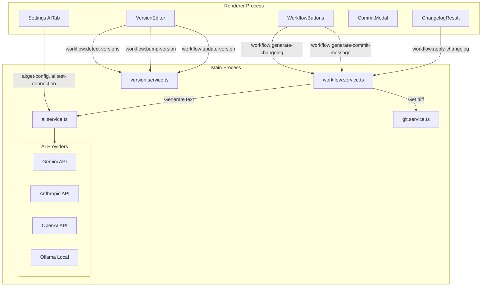

### AI Service

The `AIService` class provides a unified `complete()` method that dispatches to the configured provider. Configuration (provider, API key, model, base URL) is stored in the `settings` table as JSON under the `aiConfig` key.

**Supported Providers:**

| Provider  | Models                                             | Auth         |
| --------- | -------------------------------------------------- | ------------ |
| Gemini    | gemini-2.5-flash, gemini-2.0-flash, gemini-1.5-pro | API Key      |
| Anthropic | claude-sonnet-4-5, claude-haiku-4-5                | API Key      |
| OpenAI    | gpt-4o, gpt-4o-mini, gpt-4-turbo                   | API Key      |
| Ollama    | Any local model                                    | None (local) |

### Workflow Generation Flows

**Changelog Generation:**

1. `WorkflowService.generateChangelog()` fetches the full git diff and file status
2. Builds a per-file change summary to ensure all changed files are covered
3. Constructs a Keep-a-Changelog-format prompt with existing changelog style context
4. Sends to AI provider via `aiService.complete()`
5. Post-processes response: strips code fences, trims incomplete trailing lines
6. Returns structured entry with category headings (Added, Changed, Fixed, etc.)
7. `applyChangelog()` merges entries into CHANGELOG.md under `[Unreleased]`

**Commit Message Generation:**

1. `WorkflowService.generateCommitMessage()` fetches staged diff via `git:diff-staged`
2. Constructs a prompt for conventional commit format (type(scope): description)
3. Sends to AI with low temperature (0.3) and 512 max tokens
4. Returns a single-line conventional commit message

### IPC Channels

| Channel                            | Direction        | Purpose                              |
| ---------------------------------- | ---------------- | ------------------------------------ |
| `ai:complete`                      | Renderer -> Main | AI text completion                   |
| `ai:test-connection`               | Renderer -> Main | Test AI provider connectivity        |
| `ai:get-config`                    | Renderer -> Main | Get AI configuration                 |
| `workflow:generate-changelog`      | Renderer -> Main | Generate changelog from git diff     |
| `workflow:generate-commit-message` | Renderer -> Main | Generate commit message from staging |
| `workflow:apply-changelog`         | Renderer -> Main | Write changelog entry to file        |

---

## Project Creation Wizard Architecture

The New Project Wizard provides a multi-step project creation flow that scaffolds projects using ecosystem-specific CLI tools, configures databases, sets up GitHub repositories, and initializes git.

### Wizard Flow

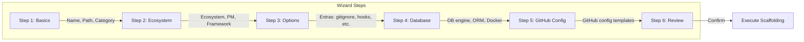

### Scaffolding Pipeline

```mermaid
sequenceDiagram
    participant Wizard as NewProjectWizard
    participant IPC as IPC Handlers
    participant Scaffold as ProjectScaffoldService
    participant CLI as CLI Tools
    participant DBScaffold as DatabaseScaffoldService
    participant Git as GitService
    participant GitHub as GitHubRestService

    Wizard->>IPC: project:scaffold(config)
    IPC->>Scaffold: scaffold(config)
    Scaffold->>CLI: Execute scaffold command (e.g., npm create vite)
    CLI-->>Scaffold: Project created
    Scaffold->>Scaffold: Add extras (gitignore, editorconfig, license, README)

    opt Database selected
        Wizard->>IPC: project:scaffold-database(config)
        IPC->>DBScaffold: scaffoldDatabase(config)
        DBScaffold-->>Wizard: DB files created
    end

    opt Create GitHub repo
        Wizard->>IPC: project:create-github-repo(name, options)
        IPC->>GitHub: createRepository(name, options)
        GitHub-->>Wizard: Repo URL
    end

    Wizard->>IPC: project:initialize-git(path, remote, url)
    IPC->>Git: init, create branches, commit, push
    Git-->>Wizard: Git initialized
```

### CLI Detection and Installation

Before scaffolding, the wizard validates required CLI tools via `project:check-cli-tools`. The `CLIDetectionService` checks for ecosystem-specific tools (Node.js, Python, Rust, Go, Ruby, PHP, Java) and can install missing tools via `project:install-tool`.

### IPC Channels

| Channel                            | Direction        | Purpose                                 |
| ---------------------------------- | ---------------- | --------------------------------------- |
| `project:scan-directory`           | Renderer -> Main | Scan directory for project metadata     |
| `project:check-cli-tools`          | Renderer -> Main | Check CLI tool availability             |
| `project:validate-package-manager` | Renderer -> Main | Validate package manager is installed   |
| `project:install-tool`             | Renderer -> Main | Install a CLI tool                      |
| `project:scaffold`                 | Renderer -> Main | Scaffold new project                    |
| `project:scaffold-database`        | Renderer -> Main | Scaffold database layer                 |
| `project:get-orm-options`          | Renderer -> Main | Get ORM options for ecosystem/engine    |
| `project:create-github-repo`       | Renderer -> Main | Create GitHub repository                |
| `project:initialize-git`           | Renderer -> Main | Initialize git with branches and remote |

---

## GitHub Configuration Management

Cola Records provides a visual editor for managing the `.github/` directory, supporting 12 GitHub configuration features with built-in templates.

### Architecture Overview

```mermaid
graph TD
    subgraph Renderer["Renderer Process"]
        GitHubConfigTool[GitHubConfigTool]
        GitHubConfigPanel[GitHubConfigPanel]
        subgraph FileEditors["File Editors"]
            YamlEditor[GitHubConfigYamlEditor]
            MarkdownEditor[GitHubConfigMarkdownEditor]
            WorkflowsEditor[GitHubConfigWorkflowsEditor]
            IssueTemplatesEditor[GitHubConfigIssueTemplatesEditor]
            CodeownersEditor[GitHubConfigCodeownersEditor]
        end
    end

    subgraph Main["Main Process"]
        ConfigService[github-config.service.ts]
        Templates[Built-in Templates]
        FS[File System]
    end

    GitHubConfigTool --> GitHubConfigPanel
    GitHubConfigPanel --> FileEditors

    GitHubConfigPanel -->|github-config:scan| ConfigService
    FileEditors -->|github-config:read-file| ConfigService
    FileEditors -->|github-config:write-file| ConfigService
    GitHubConfigPanel -->|github-config:create-from-template| ConfigService
    ConfigService --> FS
    ConfigService --> Templates
```

### Supported Features (12)

| Feature              | Path                       | Tier       | Description                       |
| -------------------- | -------------------------- | ---------- | --------------------------------- |
| Workflows            | `workflows/`               | Repository | GitHub Actions CI/CD workflows    |
| Dependabot           | `dependabot.yml`           | Repository | Automated dependency updates      |
| Release Notes        | `release.yml`              | Repository | Auto-generated release categories |
| Issue Templates      | `ISSUE_TEMPLATE/`          | Repository | Structured issue forms            |
| PR Template          | `PULL_REQUEST_TEMPLATE.md` | Repository | Pull request description template |
| Labeler              | `labeler.yml`              | Repository | Auto-label PRs by file path       |
| CODEOWNERS           | `CODEOWNERS`               | Repository | Automatic PR review assignment    |
| Auto-Assign          | `auto_assign.yml`          | Community  | Auto-assign reviewers             |
| Copilot Instructions | `copilot-instructions.md`  | Community  | AI coding conventions             |
| Funding              | `FUNDING.yml`              | Community  | Sponsor button configuration      |
| Security Policy      | `SECURITY.md`              | Community  | Vulnerability reporting           |
| Stale                | `stale.yml`                | Community  | Auto-close inactive issues/PRs    |

### Template System

Each feature has one or more built-in templates that can be deployed via `github-config:create-from-template`. Templates are string literals with sensible defaults (e.g., Node.js CI workflow, bug report form, PR checklist). The service prevents overwriting existing files.

---

## Version Management Architecture

The Version Management system detects, bumps, and updates version numbers across multiple manifest file formats.

### Architecture Overview

```mermaid
graph TD
    subgraph Renderer["Renderer Process"]
        VersionEditor[VersionEditor]
    end

    subgraph Main["Main Process"]
        VersionService[version.service.ts]
        ManifestFiles["Manifest Files"]
    end

    VersionEditor -->|workflow:detect-versions| VersionService
    VersionService -->|Scan for files| ManifestFiles
    VersionService -->|Extract version| ManifestFiles

    VersionEditor -->|workflow:bump-version| VersionService
    VersionEditor -->|workflow:update-version| VersionService
    VersionService -->|Write new version| ManifestFiles
```

### Supported Manifest Files

| File                | Package Manager | Version Extraction Method         |
| ------------------- | --------------- | --------------------------------- |
| `package.json`      | npm             | JSON parse `version` field        |
| `package-lock.json` | npm             | JSON parse `version` field        |
| `Cargo.toml`        | cargo           | Regex under `[package]` section   |
| `pyproject.toml`    | pip             | Regex `version = "..."`           |
| `setup.py`          | pip             | Regex `version='...'`             |
| `build.gradle`      | gradle          | Regex `version = '...'`           |
| `pom.xml`           | maven           | XML `<version>` under `<project>` |

### Version Bumping

The `bumpVersion()` method implements standard semantic versioning:

- **major**: `1.2.3` -> `2.0.0`
- **minor**: `1.2.3` -> `1.3.0`
- **patch**: `1.2.3` -> `1.2.4`

The `updateVersion()` method writes the new version to all specified files, using format-aware replacement (JSON for package.json, regex for TOML/XML/Gradle).

---

**Generated by:** APO (Documentation Specialist)
**Source:** JUNO Audit Report 2026-02-11
